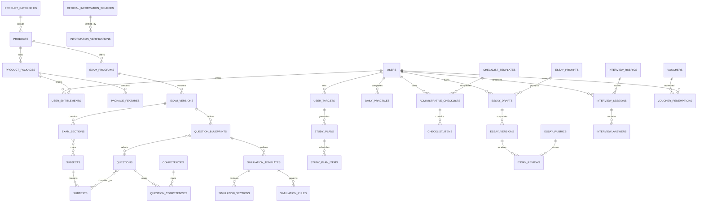

# Product Requirements Document (PRD) — Sinaesta

**Positioning:** **Sinaesta — Platform Persiapan Ujian Akademik dan Profesi**  
**Status:** siap untuk discovery teknis dan desain; keputusan pada §26 tetap memerlukan sign-off  
**Versi dokumen:** 2.0  
**Pemilik:** Product Manager  
**Audiens:** Product, UI/UX, frontend, backend, database, QA, DevOps, editor soal, reviewer materi, legal/privacy, dan stakeholder bisnis  
**Prinsip versi:** dokumen ini memperluas produk Sinaesta latihan dokter spesialis; seluruh kapabilitas Med tetap dipertahankan.

---

## 1. Executive summary baru

Sinaesta menyediakan latihan interaktif, simulasi ujian, pembahasan terstruktur, serta analisis progres untuk persiapan dokter spesialis, tes potensi akademik, seleksi masuk perguruan tinggi, dan beasiswa. Ekspansi dilakukan sebagai satu platform modular dengan satu akun, empat lini produk, bank soal bersama, blueprint ujian berversi, dan entitlement per produk—bukan dengan memasukkan TPA, SIMAK, atau LPDP sebagai spesialisasi medis.

Produk awal **Sinaesta Med** tetap menyediakan bank soal 29 spesialisasi, kuis topik, tryout, hasil, riwayat, pembahasan, statistik, bookmark, pembayaran, dan panel admin. Di atas fondasi tersebut ditambahkan **Sinaesta TPA**, **Sinaesta SIMAK — Program Persiapan Independen**, serta **Sinaesta LPDP — Program Persiapan Independen**. Struktur konten memisahkan soal orisinal dari konfigurasi pemakaiannya sehingga satu kompetensi/soal dapat dipakai lintas paket tanpa menduplikasi isi, sementara durasi, bobot, jumlah soal, dan aturan simulasi tetap spesifik pada blueprint.

Keberhasilan ekspansi dinilai dari penggunaan dan peningkatan metrik belajar internal, bukan klaim kelulusan. Informasi lembaga wajib bersumber, berversi, diverifikasi, dan kedaluwarsa secara eksplisit. Seluruh skor, persentil, readiness indicator, rubrik esai, dan rubrik wawancara diberi label sebagai metrik internal dan bukan hasil resmi.

### 1.1 Sasaran dan non-sasaran

| Jenis | Pernyataan |
|---|---|
| Sasaran | Menyediakan ekosistem persiapan modular; personalisasi target dan rencana; assessment yang dapat diaudit; pengelolaan konten lintas program; monetisasi fleksibel; perlindungan privasi dan HKI. |
| Non-sasaran | Menjadi penyelenggara ujian resmi; menjamin kelulusan; menerbitkan skor psikologis/resmi; menjual bocoran; mengatasnamakan UI, LPDP, atau Kementerian Keuangan; menyimpan dokumen administrasi sensitif pada MVP. |

## 2. Reposisi produk

### 2.1 Product portfolio

| Produk | Nilai utama | Target pengguna | Program/paket latihan | Warna sekunder |
|---|---|---|---|---|
| Sinaesta Med | Bank soal dan latihan 29 spesialisasi | Dokter/peserta seleksi pendidikan spesialis | Spesialisasi → topik; kuis, tryout, salah, bookmark | Biru medis + cyan |
| Sinaesta TPA | Latihan potensi akademik modular | Pendaftar S2/S3/profesi/beasiswa/universitas/pekerjaan dan pengukur kemampuan akademik | Verbal, numerik, figural, bahasa akademik; diagnostic, latihan, simulasi | Indigo + violet |
| Sinaesta SIMAK | Persiapan independen sesuai target jalur | Pendaftar profesi, spesialis, magister, doktor, dan program relevan | PKA, Bahasa Inggris, materi profesi bila relevan; paket per jenjang/periode | Biru tua + emas netral, tidak meniru UI |
| Sinaesta LPDP | Persiapan aplikasi beasiswa end-to-end | Calon pendaftar skema LPDP | Administrasi, SBS, esai, wawancara, planner | Teal + emerald, tidak meniru LPDP |

Setiap produk **MUST** memiliki landing page, deskripsi, target pengguna, daftar program, paket latihan, dashboard terpisah, statistik, harga atau status “belum ditetapkan”, FAQ, disclaimer, riwayat aktivitas, target belajar, serta identitas warna sekunder. Product switcher menampilkan keempat produk dan status aksesnya. Satu identitas visual primer Sinaesta menjaga konsistensi ekosistem.

## 3. Information architecture

```text
Product Category
└── Exam Program
    └── Exam Version
        └── Exam Section
            └── Subject
                └── Subtest
                    └── Question
```

Contoh LPDP: `Seleksi Beasiswa → LPDP → LPDP 2026 Tahap 2 → Seleksi Bakat Skolastik → Penalaran → Penalaran Kuantitatif → Soal`.  
Contoh SIMAK: `Seleksi Universitas → SIMAK UI → SIMAK UI Program Spesialis → Pengukuran Kemampuan Akademik → Kemampuan Verbal → Analogi → Soal`.

**Aturan pemodelan:**

1. Product Category adalah taksonomi pasar; Product adalah lini komersial; Exam Program adalah tujuan ujian. Spesialisasi Med adalah program/subject sesuai konfigurasi, bukan kategori bagi produk lain.
2. Exam Version membekukan struktur untuk periode tertentu. Versi terbit tidak diedit destruktif; revisi membuat versi baru.
3. Question adalah aset kanonik. Relasi many-to-many menghubungkannya ke kompetensi, taksonomi, dan blueprint.
4. Blueprint memilih kriteria/pool dan aturan; Simulation Template membekukan blueprint version serta question snapshot/selection saat attempt dibuat.
5. Topic dan subtopic merupakan taksonomi editorial lintas konteks; subject/subtest adalah struktur program.

### 3.1 User journey terpadu

1. Pengguna menemukan landing produk → membaca target, cakupan, harga, FAQ, disclaimer.
2. Mendaftar/login satu akun → memilih produk/program/target tanggal.
3. Sistem memeriksa entitlement → demo/checkout/akses aktif.
4. Pengguna diagnostic (jika tersedia) → baseline dan rekomendasi internal.
5. Planner menyusun rencana → latihan, daily practice, review, dan simulasi.
6. Attempt menyimpan snapshot soal/aturan → hasil dan pembahasan → analitik produk.
7. Pengguna memperbaiki kelemahan → memantau riwayat dan target tanpa mencampur statistik produk.

## 4. Shared question bank

### 4.1 Metadata dan penggunaan

Setiap soal **MUST** mendukung kategori, program ujian, versi ujian, bagian, mata uji, subtes, topik, subtopik, kompetensi (many-to-many), tingkat kesulitan, tipe soal, estimasi waktu, tag, tahun berlaku, status editorial, sumber/referensi, author, reviewer, approver, versi, tanggal review berikutnya, copyright status, dan change history.

Soal kompetensi yang sama dapat masuk paket TPA, SIMAK, dan SBS LPDP melalui `question_blueprints`, tanpa salinan isi. Tiap blueprint menetapkan jumlah, durasi, bobot, urutan/acak, navigasi, passing/target internal, negative marking, review behavior, dan distribusi kesulitan secara independen. Attempt selalu menyimpan ID versi serta snapshot penyajian dan scoring agar perubahan berikutnya tidak mengubah hasil historis.

### 4.2 Pencegahan duplikasi dan workflow editorial

| Kontrol | Requirement |
|---|---|
| Fingerprint | Normalisasi stem + tipe + pilihan, hash deterministik, unique warning; collision ditinjau manual. |
| Kemiripan teks | Similarity score stem/pembahasan terhadap konten aktif dan arsip, dengan threshold dapat dikonfigurasi. |
| Pilihan jawaban | Bandingkan set pilihan ternormalisasi tanpa bergantung urutan. |
| Kompetensi | Kandidat duplikat diprioritaskan dalam kompetensi/topik sama, tetapi pemeriksaan global tetap tersedia. |
| Admin warning | Create/import/publish menampilkan pasangan kandidat dan alasan; override wajib alasan serta audit. |

Status editorial: **Draft → In Review → Revision Required → Approved → Published → Archived/Outdated**. Setiap materi memiliki author, reviewer, approved by, version, review date, next review date, source, copyright status, dan change history. Materi berbasis kebijakan lembaga wajib menyimpan periode, sumber resmi, tanggal verifikasi; setelah periode/expiry berakhir status menjadi Outdated dan tidak diperbarui otomatis tanpa verifikasi manusia.

## 5. Sinaesta TPA

### 5.1 Cakupan materi

| Subject | Subtes/topik |
|---|---|
| Verbal | Analogi, sinonim, antonim, klasifikasi kata, penalaran logis, penalaran analitis, pemahaman bacaan, kesimpulan verbal |
| Numerik | Aritmetika, operasi bilangan, rasio dan proporsi, persentase, deret angka, aljabar dasar, soal cerita, interpretasi tabel/grafik, penalaran kuantitatif |
| Figural | Analisis/sintesis bentuk, matriks gambar, rotasi, refleksi, pola, hubungan spasial, bangun ruang |
| Bahasa Akademik | Pemahaman bacaan, ide utama, inferensi, vocabulary in context, struktur kalimat, Academic English |

Struktur ini adalah kurikulum latihan Sinaesta, **bukan format resmi lembaga tertentu**.

### 5.2 Mode, diagnostic, dan analitik

Mode: diagnostic, kategori, subtes, topik, kesulitan, pernah salah, bookmark, latihan cepat, simulasi penuh/custom, dan daily practice.

Diagnostic mengambil sampel lintas subtes sesuai blueprint, mengukur baseline, kekuatan, kelemahan, lalu merekomendasikan latihan. Hasil tidak boleh disebut diagnosis psikologis atau skor resmi. Analitik: skor mentah, akurasi, kecepatan, rerata waktu/soal, akurasi/subtes, matriks speed–accuracy, soal terlama, topik terkuat/terlemah, tren skor, konsistensi, persentil internal, dan readiness indicator internal. UI hasil selalu menampilkan: **“Persentil dan readiness indicator adalah metrik internal Sinaesta, bukan skor resmi.”**

## 6. Sinaesta SIMAK — Program Persiapan Independen

Disclaimer pada landing, checkout, dan dashboard: **“Sinaesta merupakan platform persiapan independen dan tidak berafiliasi dengan Universitas Indonesia. Seluruh materi merupakan latihan buatan Sinaesta dan bukan soal resmi SIMAK UI.”** Logo, lambang, atau aset visual UI tidak digunakan tanpa izin.

Pengguna memilih jenjang (Profesi/Spesialis/Magister/Doktor), program studi, jalur seleksi, periode, dan target tanggal. Konfigurasi materi bersifat per kombinasi tersebut; sistem tidak mengasumsikan kesamaan ujian antarjenjang.

| Bagian | Cakupan/aturan |
|---|---|
| PKA | Verbal, kuantitatif, logika, analitis, pemahaman bacaan |
| Bahasa Inggris | Reading comprehension, vocabulary, grammar, structure, academic passages, inference, main idea |
| Materi profesi | Per prodi; terpisah dari PKA; reviewer bidang wajib; hanya untuk program relevan; feature toggle admin; versi per periode |

Fitur: pemilihan target, informasi struktur, kalender target, study planner, diagnostic, latihan/bagian, simulasi, paket intensif, countdown, tracking, analisis subtes/waktu, riwayat, target skor internal, notifikasi perubahan, “terakhir diperbarui”, dan tautan resmi. Setiap informasi jadwal/materi/persyaratan menyimpan sumber, URL, tanggal berlaku, tanggal diperiksa, admin pemeriksa, status validasi, dan expiry.

## 7. Sinaesta LPDP — Program Persiapan Independen

Disclaimer pada landing, checkout, dan dashboard: **“Sinaesta tidak berafiliasi dengan LPDP atau Kementerian Keuangan. Materi, simulasi, penilaian, dan rekomendasi pada platform ini bukan materi atau penilaian resmi LPDP.”** Logo LPDP/Kementerian Keuangan tidak digunakan tanpa izin.

### 7.1 Administrative checklist (MVP)

Profil checklist: tahun/tahap seleksi, jenjang, skema beasiswa, status LoA, dalam/luar negeri, universitas dan program studi tujuan. Item memuat status **Belum dimulai/Sedang disiapkan/Siap/Sudah diunggah/Perlu diperbarui/Tidak berlaku**, deadline, reminder, catatan pribadi, sumber resmi, dan tanggal pemeriksaan.

MVP hanya menyimpan checklist/status/catatan; tidak mewajibkan upload dokumen sensitif. Upload post-MVP memerlukan encryption at rest/in transit, object-level access control, retention policy, secure deletion, malware/file scanning, immutable audit log, consent eksplisit, dan privacy impact assessment sebelum rilis.

### 7.2 Seleksi Bakat Skolastik (SBS)

Blueprint tersendiri dapat merujuk shared bank TPA untuk penalaran verbal/kuantitatif, pemecahan masalah, penalaran logis, dan analisis informasi. Fitur: diagnostic, latihan kompetensi, simulasi, timer, navigation panel, mark for review, analisis waktu/akurasi, latihan kelemahan, riwayat, target internal, countdown. Semua konten disebut latihan orisinal, tidak pernah “soal resmi” atau “bocoran”.

### 7.3 Essay workspace

Fitur: editor, autosave, word/character count, version history, comparison, outline builder, checklist substansi, self-assessment rubric, mentor notes, export PDF, duplicate draft, serta status **Draft/Ready for Review/Reviewed/Final**. Kategori prompt: profil diri, komitmen kembali, kontribusi, studi, kepemimpinan, kegagalan, dampak sosial, karier, alasan prodi, dan alasan universitas.

Rubrik internal menilai kejelasan tujuan, argumentasi, konsistensi, contoh konkret, relevansi studi/kontribusi, kelayakan rencana, refleksi diri, struktur, dan kebahasaan. Skor berlabel alat evaluasi internal dan tidak menjamin lolos. AI post-MVP hanya boleh memberi pertanyaan reflektif, menilai struktur, menunjukkan ketidakjelasan/inkonsistensi, dan menyarankan perbaikan; AI dilarang mengarang pengalaman/prestasi, menulis identitas pengguna secara utuh, menjamin kelulusan, atau menyamarkan plagiarisme.

### 7.4 Interview simulator

Fitur: bank/acak/berbasis profil, timer persiapan/jawaban, follow-up, mode mandiri/interviewer, catatan, rubrik, riwayat, target perbaikan, audio opsional; video post-MVP. Consent wajib sebelum merekam; pengguna dapat menghapus rekaman dan mengatur retensi.

Kategori: motivasi, akademik, universitas, prodi, kontribusi, kepemimpinan, integritas, nasionalisme, tantangan studi, kegagalan, konflik, dampak sosial, pascalulus, konsistensi esai. Rubrik internal: kejelasan, konsistensi, relevansi, kedalaman, bukti konkret, struktur jawaban, komunikasi, manajemen waktu—bukan rubrik resmi LPDP.

## 8. Study planner dan Daily Practice

Planner lintas produk menerima produk/program, target tanggal/skor internal, hari dan durasi belajar, prioritas, serta hari istirahat. Sistem menghasilkan rencana mingguan, target soal/simulasi/review, reminder, progress, rekomendasi topik, countdown, dan rescheduling otomatis. Ketertinggalan menggeser item yang belum selesai tanpa menghapus progres atau mengubah attempt historis.

Daily Practice default lima soal/hari berdasarkan kelemahan, campuran topik, dan cooldown agar soal tidak cepat berulang; mencakup streak, reminder, pembahasan, dan rekap mingguan. Admin dapat mengatur jumlah, komposisi, kesulitan, kategori, cooldown, serta periode aktif per produk/program.

## 9. Paket, harga, dan entitlement

| Paket | Cakupan | Harga/status |
|---|---|---|
| Gratis | Demo 5 soal, diagnostic terbatas, statistik dasar, daily practice terbatas | Limit dapat dikonfigurasi |
| Sinaesta Med | Seluruh bank Med, kuis topik, tryout, pembahasan, statistik, bookmark | **Rp50.000 sekali bayar** untuk cakupan versi awal |
| Sinaesta TPA | Semua subtes, diagnostic, simulasi, analitik lengkap, latihan adaptif | Open question stakeholder |
| Sinaesta SIMAK | Per jenjang: PKA, Inggris, materi profesi tersedia, simulasi, planner | Open question stakeholder |
| Sinaesta LPDP | Checklist, SBS, essay, interview, planner | Open question stakeholder |
| All Access | Seluruh produk/fitur | Harga dan masa aktif oleh admin; open question |

Commerce mendukung sekali bayar, akses periode, bundle, promotional price, voucher, dan complimentary access admin. Harga tersimpan sebagai data efektif-bertanggal; tidak hard-coded.

Entitlement menyimpan user, product, package, start/end, lifetime flag, status (pending/active/expired/revoked), source, payment number, granting admin, change reason, created/revoked timestamp. Seorang user dapat sekaligus memiliki Med lifetime, TPA aktif sampai tanggal tertentu, SIMAK tidak aktif, dan LPDP pending. Approval pembayaran dan pembuatan entitlement berlangsung satu transaksi database yang idempoten; pencabutan tidak menghapus histori.

## 10. Functional requirements

| ID | Requirement | Prioritas |
|---|---|---|
| FR-001 | Satu akun, session aman, product switcher, dan status entitlement per produk | Must |
| FR-002 | Landing/dashboard/statistik/riwayat/target/FAQ/disclaimer tiap produk terpisah | Must |
| FR-003 | Hierarki kategori→program→versi→bagian→subject→subtest dan versioning | Must |
| FR-004 | Shared question bank, relasi kompetensi, fingerprint dan duplicate checker | Must |
| FR-005 | Blueprint/simulasi berversi dan immutable attempt snapshot | Must |
| FR-006 | Med mempertahankan 29 spesialisasi, kuis, tryout, hasil, riwayat, pembahasan, statistik, bookmark | Must |
| FR-007 | TPA diagnostic, mode latihan, simulasi, dan analitik subtes/speed–accuracy | Must |
| FR-008 | SIMAK target multidimensi dan materi konfigurabel per jenjang/prodi/periode | Must |
| FR-009 | LPDP checklist status-only pada MVP dan sumber terverifikasi | Must |
| FR-010 | LPDP SBS memakai blueprint sendiri walau pool soal dibagi | Must |
| FR-011 | Essay autosave, versi, comparison, rubric, sharing terkontrol, PDF | Must |
| FR-012 | Interview simulator, consent audio, delete/retention; video post-MVP | Must/Should |
| FR-013 | Planner reschedule tanpa menghapus progres; daily practice konfigurabel | Must |
| FR-014 | Paket/harga efektif-bertanggal, checkout, voucher, dan entitlement | Must |
| FR-015 | Informasi resmi bersumber, diverifikasi, expired, dan change notification | Must |
| FR-016 | Workflow editorial, similarity override beralasan, report question/takedown | Must |
| FR-017 | Export data pengguna dan penghapusan sesuai retention/legal hold | Should |
| FR-018 | AI assist esai dengan guardrail hanya setelah governance disetujui | Could/Post-MVP |
| FR-019 | Upload dokumen sensitif dan video wawancara | Won't in MVP |

## 11. Business rules

| ID | Aturan |
|---|---|
| BR-01 | Satu akun dapat memiliki beberapa produk; akses ditentukan per produk/entitlement. |
| BR-02 | Harga dapat berbeda per produk, paket, dan periode efektif. |
| BR-03 | Bank soal dapat digunakan beberapa program; blueprint tidak mengubah soal sumber. |
| BR-04 | Soal/aturan yang digunakan tetap tercatat sebagai snapshot attempt. |
| BR-05 | Versi ujian lama dapat diarsipkan tetapi histori tetap dapat direkonstruksi. |
| BR-06 | Informasi expired/outdated tidak tampil sebagai informasi aktif. |
| BR-07 | Informasi lembaga wajib memiliki sumber resmi dan verifikasi manusia. |
| BR-08 | Skor simulasi/diagnostic/persentil/readiness/rubrik bukan skor resmi atau diagnosis. |
| BR-09 | Sinaesta tidak menjamin kelulusan dan konten tidak boleh disebut bocoran/resmi. |
| BR-10 | Pengguna hanya melihat esainya; mentor hanya melihat draft yang dibagikan dan selama akses berlaku. |
| BR-11 | Rekaman butuh consent per sesi, dapat dihapus pengguna, dan tunduk retention. |
| BR-12 | Checklist bukan bukti administrasi diterima. |
| BR-13 | Approval pembayaran membuat entitlement secara transaksional dan idempoten. |
| BR-14 | Pembatalan/refund/revoke tidak menghapus payment atau audit log. |
| BR-15 | Limit produk gratis dapat dikonfigurasi admin. |
| BR-16 | Publikasi konten membutuhkan reviewer berbeda sesuai kebijakan segregation of duties; materi profesi membutuhkan reviewer bidang. |
| BR-17 | Harga, jadwal, format, serta ketentuan belum pasti tidak boleh dipresentasikan sebagai fakta aktif. |
| BR-18 | Pertanyaan yang berubah setelah publish menghasilkan version baru, bukan overwrite. |
| BR-19 | Penghapusan akun tidak boleh merusak agregat anonim; PII dianonimkan sesuai kebijakan retensi. |
| BR-20 | SIMAK/LPDP tidak menggunakan logo atau trade dress lembaga tanpa izin tertulis. |

## 12. User stories dan acceptance criteria

Semua acceptance criteria berikut wajib diotomasi bila layak dan diuji juga untuk akses negatif.

| ID | User story | Acceptance criteria Given–When–Then | Pri. |
|---|---|---|---|
| US-01 | Sebagai pengunjung, saya ingin membandingkan produk. | **Given** landing, **When** membuka portfolio, **Then** empat produk, target, cakupan, harga/status, FAQ, disclaimer tampil. | Must |
| US-02 | Sebagai pengguna, saya ingin berpindah produk. | **Given** login, **When** memilih switcher, **Then** dashboard produk dan status akses yang benar dibuka. | Must |
| US-03 | Saya ingin satu akun untuk beberapa produk. | **Given** dua entitlement aktif, **When** login, **Then** keduanya dapat diakses tanpa akun lain. | Must |
| US-04 | Saya ingin target belajar per produk. | **Given** entitlement, **When** menyimpan tanggal/skor internal, **Then** target tersimpan hanya pada produk/program itu. | Must |
| US-05 | Saya ingin diagnostic TPA lintas subtes. | **Given** blueprint aktif, **When** mulai diagnostic, **Then** soal berasal dari beberapa subtes sesuai distribusi. | Must |
| US-06 | Saya ingin melihat baseline TPA. | **Given** diagnostic submitted, **When** hasil dibuat, **Then** baseline, kuat/lemah, rekomendasi, dan disclaimer internal tampil. | Must |
| US-07 | Saya ingin latihan TPA per subtes. | **Given** subtes dipilih, **When** memulai, **Then** hanya soal eligible dan entitlement-valid disajikan. | Must |
| US-08 | Saya ingin latihan soal yang pernah salah. | **Given** histori salah, **When** memilih mode salah, **Then** sistem mengambil soal kanonik terkait tanpa mengubah attempt lama. | Must |
| US-09 | Saya ingin simulasi TPA penuh. | **Given** template published, **When** mulai, **Then** durasi, jumlah, section, dan aturan mengikuti versi blueprint. | Must |
| US-10 | Saya ingin simulasi custom. | **Given** batas konfigurasi, **When** memilih subtes/kesulitan/durasi, **Then** validasi dan attempt custom dibuat. | Should |
| US-11 | Saya ingin membandingkan kecepatan dan akurasi. | **Given** attempt submitted, **When** membuka analytics, **Then** rerata waktu, akurasi, kuadran speed–accuracy, dan soal terlama tampil. | Must |
| US-12 | Saya ingin memantau target skor. | **Given** target internal, **When** hasil baru masuk, **Then** tren/gap diperbarui tanpa klaim skor resmi. | Must |
| US-13 | Saya ingin daily practice relevan. | **Given** kelemahan terukur, **When** membuka latihan hari ini, **Then** default lima soal campuran mematuhi cooldown. | Must |
| US-14 | Saya ingin bookmark soal. | **Given** soal terlihat, **When** bookmark dipilih, **Then** soal muncul pada koleksi produk terkait. | Must |
| US-15 | Sebagai calon peserta SIMAK, saya ingin memilih jenjang/jalur. | **Given** konfigurasi aktif, **When** memilih jenjang dan jalur, **Then** hanya periode/prodi valid tersedia. | Must |
| US-16 | Saya ingin memilih program studi. | **Given** jenjang/jalur, **When** memilih prodi, **Then** materi relevan dan status ketersediaan tampil. | Must |
| US-17 | Saya ingin materi profesi yang tepat. | **Given** prodi mendukung materi profesi, **When** dashboard dibuka, **Then** modul versi periodenya tampil; untuk prodi lain tersembunyi. | Must |
| US-18 | Saya ingin mengikuti paket SIMAK. | **Given** entitlement paket jenjang, **When** membuka latihan, **Then** hanya fitur paket dan versi eligible dapat diakses. | Must |
| US-19 | Saya ingin study planner SIMAK. | **Given** target tanggal dan hari belajar, **When** generate, **Then** rencana mingguan, review, simulasi, dan countdown dibuat. | Must |
| US-20 | Saya ingin memeriksa sumber informasi. | **Given** informasi seleksi, **When** detail dibuka, **Then** URL resmi, berlaku, diperiksa, status, dan last updated tampil. | Must |
| US-21 | Saya ingin diberi tahu perubahan informasi. | **Given** sumber tervalidasi berubah, **When** versi baru dipublish, **Then** pengguna terdampak menerima notifikasi dengan ringkasan. | Should |
| US-22 | Saya ingin memilih skema LPDP. | **Given** tahun/tahap aktif, **When** memilih jenjang, LoA, lokasi, skema, **Then** checklist template cocok dibuat. | Must |
| US-23 | Saya ingin membuat checklist administrasi. | **Given** profil aplikasi, **When** create, **Then** item, sumber, dan status awal tersalin dari template berversi. | Must |
| US-24 | Saya ingin memperbarui status item. | **Given** item milik saya, **When** status/catatan diubah, **Then** perubahan tersimpan dan diaudit tanpa upload wajib. | Must |
| US-25 | Saya ingin mengatur deadline/reminder. | **Given** item checklist, **When** deadline diatur, **Then** reminder dijadwalkan pada zona waktu pengguna. | Must |
| US-26 | Saya ingin diagnostic SBS. | **Given** blueprint SBS, **When** diagnostic dimulai, **Then** shared questions dipilih memakai aturan SBS sendiri. | Must |
| US-27 | Saya ingin menulis esai dengan autosave. | **Given** draft editable, **When** mengetik, **Then** perubahan tersimpan berkala dan count diperbarui. | Must |
| US-28 | Saya ingin menyimpan versi esai. | **Given** draft, **When** create version, **Then** snapshot immutable bernomor tersimpan. | Must |
| US-29 | Saya ingin membandingkan versi. | **Given** dua versi, **When** compare, **Then** penambahan/penghapusan ditandai tanpa mengubah keduanya. | Should |
| US-30 | Saya ingin menilai esai sendiri. | **Given** rubrik aktif, **When** memberi nilai, **Then** skor internal dan disclaimer tersimpan per versi. | Must |
| US-31 | Saya ingin berbagi esai ke mentor. | **Given** draft privat, **When** memberi akses mentor, **Then** mentor itu saja dapat melihat/komentar hingga akses dicabut. | Must |
| US-32 | Saya ingin export esai PDF. | **Given** draft, **When** export, **Then** PDF berisi versi terpilih dan metadata non-sensitif dibuat. | Should |
| US-33 | Saya ingin simulasi wawancara acak. | **Given** kategori/profile, **When** mulai, **Then** pertanyaan eligible, timer, dan follow-up disajikan. | Must |
| US-34 | Saya ingin merekam audio secara opsional. | **Given** belum consent, **When** record dipilih, **Then** consent eksplisit diminta sebelum capture. | Must |
| US-35 | Saya ingin menghapus rekaman. | **Given** rekaman milik saya, **When** delete dikonfirmasi, **Then** akses langsung dicabut dan secure deletion dijadwalkan/diaudit. | Must |
| US-36 | Saya ingin menilai jawaban wawancara. | **Given** sesi selesai, **When** rubrik diisi, **Then** target perbaikan dan label “rubrik internal” tampil. | Must |
| US-37 | Saya ingin membeli paket. | **Given** paket aktif, **When** pembayaran approved, **Then** payment dan entitlement dibuat atomik tepat sekali. | Must |
| US-38 | Saya ingin menggunakan voucher. | **Given** voucher valid, **When** checkout, **Then** eligibility/kuota/periode divalidasi dan redemption atomik. | Must |
| US-39 | Sebagai admin, saya ingin memberi entitlement. | **Given** izin commerce, **When** memberi akses, **Then** produk/paket/periode/alasan/admin dicatat audit. | Must |
| US-40 | Sebagai admin, saya ingin revoke entitlement. | **Given** akses aktif, **When** revoke, **Then** akses berhenti, revoked_at/alasan tercatat, histori tidak dihapus. | Must |
| US-41 | Sebagai editor, saya ingin mengelola blueprint. | **Given** bank approved, **When** versi blueprint dipublish, **Then** rule tervalidasi dan versi sebelumnya tetap merekonstruksi attempt. | Must |
| US-42 | Sebagai editor, saya ingin peringatan duplikat. | **Given** soal mirip, **When** save/import/publish, **Then** fingerprint/text/options/competency warning tampil dan override beralasan. | Must |
| US-43 | Sebagai pemeriksa, saya ingin memverifikasi info resmi. | **Given** URL sumber, **When** validasi disetujui, **Then** admin/tanggal/periode/expiry/status tercatat. | Must |
| US-44 | Sebagai admin, saya ingin mengarsipkan versi ujian. | **Given** versi tak berlaku, **When** archive, **Then** tidak dapat dipilih baru tetapi attempt lama tetap tersedia. | Must |
| US-45 | Saya ingin melaporkan soal. | **Given** soal, **When** memilih alasan dan mengirim, **Then** tiket tertaut versi soal dibuat dan acknowledgment tampil. | Must |
| US-46 | Sebagai reviewer, saya ingin memproses laporan. | **Given** tiket open, **When** resolusi dilakukan, **Then** status, tindakan, pelaku, dan change history tercatat. | Must |
| US-47 | Saya ingin planner menyesuaikan ketertinggalan. | **Given** item lewat, **When** reschedule berjalan, **Then** item mendatang disusun ulang dan progres selesai tidak dihapus. | Must |
| US-48 | Sebagai pengguna gratis, saya ingin demo. | **Given** limit aktif, **When** memakai fitur, **Then** penggunaan dihitung dan upsell muncul setelah limit, tanpa bocor fitur premium. | Must |

## 13. Database concept

Konvensi umum: MySQL/MariaDB; PK `BIGINT UNSIGNED`; FK terindeks; waktu UTC `DATETIME(6)`; uang `DECIMAL` + ISO currency; data mutabel memakai `created_at`, `updated_at`, opsional `deleted_at`; kolom `version` untuk optimistic/versioned records; audit event append-only menyimpan actor, action, entity/id, before/after yang telah direduksi dari secret/PII, request ID, timestamp. Restrict delete untuk histori; cascade hanya untuk child yang tidak memiliki nilai audit/historis.

Inventaris tabel tambahan: `product_categories`, `products`, `exam_programs`,
`exam_versions`, `exam_sections`, `subjects`, `subtests`, `competencies`,
`question_competencies`, `question_blueprints`, `simulation_templates`,
`simulation_sections`, `simulation_rules`, `product_packages`,
`package_features`, `user_entitlements`, `user_targets`, `study_plans`,
`study_plan_items`, `daily_practices`, `administrative_checklists`,
`checklist_templates`, `checklist_items`, `essay_prompts`, `essay_drafts`,
`essay_versions`, `essay_rubrics`, `essay_reviews`,
`interview_question_banks`, `interview_sessions`, `interview_answers`,
`interview_rubrics`, `official_information_sources`,
`information_verifications`, `vouchers`, dan `voucher_redemptions`.

### 13.1 Entitas inti dan constraint

| Entitas | PK dan FK utama | Unique/index | Soft delete, versi, audit, retensi |
|---|---|---|---|
| product_categories | id | UQ slug; IX status/sort | SD; V; audit; selama bisnis+arsip |
| products | id; category_id→categories | UQ slug; IX category/status | SD; V; audit; permanen |
| exam_programs | id; product_id | UQ(product_id,slug); IX status | SD; V; audit; permanen |
| exam_versions | id; program_id | UQ(program_id,code,version); IX valid dates/status | SD/archive; V immutable setelah publish; audit; permanen |
| exam_sections | id; exam_version_id | UQ(version_id,code); IX ordering | SD; V; audit |
| subjects | id | UQ canonical_code; IX name | SD; V; audit |
| subtests | id; subject_id | UQ(subject_id,code); IX subject/status | SD; V; audit |
| competencies | id; parent_id self | UQ code; IX parent/status | SD; V; audit |
| questions* | id; current_version/source refs | UQ fingerprint per version policy; IX editorial/difficulty/year | SD/archive; V via question_versions; audit; permanent if attempted |
| question_competencies | question_id, competency_id | PK pair; IX competency | no SD; audit; mengikuti question |
| question_blueprints | id; exam_version/section/subtest refs | UQ(scope,code,version); IX status | archive; V immutable published; audit; permanent |
| simulation_templates | id; blueprint_id | UQ(code,version); IX product/status | archive; V; audit; permanent |
| simulation_sections | id; template_id; section_id | UQ(template_id,position); IX section | no hard delete after publish; V/audit |
| simulation_rules | id; template_id/section_id | UQ(scope,key,version); IX template | versioned; audit; permanent |
| product_packages | id; product_id | UQ(product_id,code,version); IX sale dates/status | SD/archive; V; audit; commerce retention |
| package_features | package_id, feature_key | PK pair; IX feature | V/audit; package lifetime |
| user_entitlements | id; user/product/package/payment/admin refs | UQ(source,source_ref,product_id); IX user/product/status/end | no SD; V/audit; min. finansial/legal period |
| user_targets | id; user/product/program refs | UQ active target rule; IX user/date | SD; V/audit; account lifetime |
| study_plans/items | id; plan→user/target; item→plan | UQ(plan,version); IX user/status/date, item/date | SD; V/audit; account lifetime |
| daily_practices | id; user/product | UQ(user,product,practice_date); IX date/status | no destructive edit; audit; account lifetime/anonymize |
| checklist_templates/items | id; product/version; item→template | UQ profile signature+version; IX active dates | archive; V/audit; permanent |
| administrative_checklists/items* | id; user/template; item→checklist | UQ(user,target,template version); IX deadline/status | SD by user; V/audit; account lifetime/legal |
| essay_prompts/rubrics | id; product/version | UQ(code,version); IX status | archive; V/audit; permanent |
| essay_drafts | id; user/prompt | IX user/status; no cross-user query | SD; V/audit metadata; user retention |
| essay_versions | id; draft_id | UQ(draft_id,version_no); IX created_at | immutable; audit; until user deletion/retention |
| essay_reviews | id; essay_version/reviewer/rubric | UQ(version,reviewer,round); IX status | no overwrite; audit; sharing retention |
| interview_question_banks/rubrics | id; product/version | UQ(code,version); IX category/status | archive; V/audit |
| interview_sessions | id; user/program/rubric | IX user/date/status | SD; V/audit; user retention |
| interview_answers | id; session/question version | UQ(session,position); IX question | SD; V/audit; recording separately retained |
| official_information_sources | id; product | UQ canonical_url+scope; IX product/status | SD; V/audit; permanent verification record |
| information_verifications | id; source/admin | UQ(source,checked_at); IX valid/expiry/status | append-only; audit; permanent |
| vouchers | id | UQ code; IX active dates/status | SD; V/audit; commerce retention |
| voucher_redemptions | id; voucher/user/payment | UQ(voucher,user,payment); IX voucher/status | no SD; audit; financial retention |

`*` Entitas pendukung yang sudah ada (users, questions/question_versions, topics/subtopics, attempts/attempt_questions/answers, payments, refunds, audit_logs, reports, recordings/consents) dipertahankan dan dimigrasikan; daftar tambahan tidak berarti mengganti histori Med.

### 13.2 ERD Mermaid (hubungan utama)



## 14. API requirements

REST JSON PHP 8.2+ dengan PDO dan MySQL/MariaDB. Base URL frontend: `VITE_API_BASE_URL=https://api.sinaesta.id/api`. Endpoint resource berversi (`/api/v1/...`), autentikasi session-cookie secure atau mekanisme existing, CSRF pada mutasi, RBAC, ownership check, schema validation, pagination/filter/sort allowlist, rate limiting, idempotency key untuk pembayaran/attempt submit/autosave, ETag atau optimistic version, dan error envelope konsisten (`code`, `message`, `field_errors`, `request_id`).

| Domain | Endpoint minimum |
|---|---|
| Catalog/access | `GET /products`, `/products/{slug}/programs`, `/me/entitlements`, `/packages`; admin CRUD berversi |
| Assessment | `/questions` (admin), `/blueprints`, `/simulations`, `POST /attempts`, `/attempts/{id}/answers`, `/submit`, `/results`, `/analytics` |
| Planner | `/targets`, `/study-plans`, `/study-plans/{id}/reschedule`, `/daily-practices` |
| SIMAK/info | `/program-options`, `/official-information`, admin `/verifications`, `/change-notifications` |
| LPDP | `/checklists`, `/essay-drafts`, `/versions`, `/shares`, `/reviews`, `/interview-sessions`, `/recordings/consent` |
| Commerce | `/checkout`, `/payments`, `/vouchers/validate`, admin `/entitlements`, `/refunds` |
| Governance | `/question-reports`, `/takedown-requests`, `/audit-logs` (authorized only) |

API tidak mengirim jawaban benar sebelum attempt submitted. Snapshot/scoring dilakukan server-side. CORS production memakai allowlist origin tepat, credentials-aware, dan **bukan wildcard**. Secret hanya di backend environment; Vite hanya menerima konfigurasi publik.

## 15. Admin requirements

| Menu | Kapabilitas |
|---|---|
| Product Management | Kategori, produk, paket, fitur, harga efektif, entitlement |
| Exam Management | Program, versi, bagian, mata uji, subtes, blueprint, simulasi; preview dan publish validation |
| Content Management | Shared bank, kompetensi, topik, referensi, duplicate checker, import/export tervalidasi, editorial workflow |
| LPDP Tools | Checklist template, essay prompt/rubric, interview question/rubric |
| Information Verification | Sumber/URL, tanggal diperiksa, periode, status, admin pemeriksa, reminder review/expiry |
| Commerce | Paket, harga, pembayaran, voucher, entitlement, refund record, audit log |

RBAC minimum: Super Admin, Product Admin, Commerce Admin, Editor, Reviewer Bidang, Information Verifier, Mentor, Support, Read-only Auditor. Aksi publish, entitlement manual, refund, similarity override, export PII, dan perubahan sumber wajib audit; operasi berisiko memakai confirmation dan alasan.

## 16. UX requirements

1. Responsive, keyboard accessible, focus visible, semantic labels, contrast WCAG 2.2 AA, dan tidak mengandalkan warna saja.
2. Navbar/dashboard menyediakan product switcher; locked/pending/active/expired terlihat jelas tanpa mencampur statistik.
3. Dashboard utama: owned/unowned products, target terdekat, jadwal hari ini, daily practice, progres keseluruhan (diberi konteks), aktivitas, rekomendasi, countdown, notifikasi. Dashboard produk menampilkan hanya metrik produk itu.
4. Simulator: timer jelas, autosave jawaban, navigation grid, mark for review, offline/error recovery, konfirmasi submit, dan reduced-motion support.
5. Disclaimer kontekstual hadir sebelum diagnostic/simulasi/rubrik dan di hasil; bukan hanya footer.
6. Status sumber menampilkan last checked, valid until, official link; expired disembunyikan dari active view dan diberi state eksplisit di histori.
7. Brand primer Sinaesta konsisten; warna sekunder produk sebagaimana §2, tanpa logo/trade dress lembaga.
8. Empty/loading/error/success/expired/locked states dan mobile behavior wajib ada di design system/handoff.

## 17. Security and privacy

| Area | Kontrol minimum |
|---|---|
| Auth/access | Password hash modern, secure HttpOnly SameSite cookie, CSRF, session rotation, RBAC + object ownership, optional MFA admin, least privilege |
| Application/API | Prepared PDO, input/output validation, rate limit, CSP/security headers, CORS allowlist, dependency/SAST/DAST scanning |
| Data | TLS, encryption at rest untuk sensitif/rekaman, key rotation, secret manager/server env, backups encrypted dan restore-tested |
| Essays/mentor | Private by default; explicit scoped share; revoke; no indexing/logging content; audit read/write mentor |
| Recording | Consent version/timestamp/purpose, per-object authorization, signed short-lived URL, retention setting, secure deletion job |
| Privacy | Data minimization, purpose/retention notice, export/delete workflow, incident response, vendor/DPA review, PIA sebelum upload/video/AI |
| Audit | Append-only/tamper-evident access, actor/request ID, redact token/password/full essay/recording; monitored admin anomalies |

Retensi numerik final adalah keputusan Legal/Privacy. Sampai ditetapkan, implementasi harus configurable per data class dan legal hold; data tidak disimpan tanpa batas secara default. Checklist MVP tidak menyimpan file sensitif.

## 18. Intellectual property dan disclaimer

Semua soal wajib orisinal, bukan soal resmi/bocoran/salinan buku komersial, tanpa logo lembaga tanpa izin, memiliki catatan sumber konsep dan copyright status, serta lolos similarity review. Referensi konsep tidak memberi hak menyalin ekspresi soal.

Halaman wajib: **Disclaimer, Copyright Policy, Content Takedown Request, Report Question, Trademark Disclaimer, Academic Integrity**. Report Question menerima: soal salah, jawaban ambigu, pembahasan tidak sesuai, referensi outdated, dugaan pelanggaran hak cipta, gambar gagal, dan error teknis. SLA triase, takedown sementara untuk risiko tinggi, bukti keputusan, dan kanal banding ditetapkan sebelum launch konten publik.

## 19. KPI

| Produk | KPI utama | Guardrail/definisi |
|---|---|---|
| Platform | activation, conversion, paid entitlement activation success, D7/D30 retention, support rate | Dipisah produk/cohort; transaksi gagal dimonitor |
| TPA | diagnostic completion; latihan/subtes; perubahan akurasi/waktu; simulation completion; retention | Pre/post cohort cukup; tampilkan confidence/sample; bukan kausal kelulusan |
| SIMAK | target exam creation; study-plan completion; simulasi; paket intensif; paid conversion | Segmentasi jenjang/periode; jangan samakan format antarprogram |
| LPDP | checklist completion; draft/revisi esai; latihan wawancara; SBS completion; pre-selection retention | Tidak menganggap checklist sebagai penerimaan |
| Med | quiz/tryout completion, topik dipelajari, akurasi, retention, conversion | Baseline lama dipertahankan dan dilaporkan terpisah |
| Quality | report rate, upheld report, duplicate caught, outdated info exposure, review SLA | Zero active expired official info menjadi target guardrail |

Kelulusan resmi tidak digunakan sebagai klaim kausal tanpa consent, data representatif, kontrol bias, definisi outcome, dan metodologi valid yang ditinjau stakeholder.

## 20. Risk register

| ID | Risiko | Prob./Dampak | Mitigasi | Owner |
|---|---|---|---|---|
| R-01 | Kesan afiliasi/penyalahgunaan merek | M/H | Disclaimer kontekstual, brand review, tanpa logo/trade dress, legal review | Legal/Design |
| R-02 | Soal melanggar HKI/bocoran | M/H | Originality policy, similarity, provenance, reviewer, takedown | Content Lead |
| R-03 | Informasi lembaga kedaluwarsa | H/H | Source versioning, expiry, verifier, reminder, hide active | Product Ops |
| R-04 | Blueprint berubah merusak histori | M/H | Immutable publish/version + attempt snapshot + migration test | Backend/DB |
| R-05 | Entitlement/payment tidak konsisten | M/H | ACID transaction, idempotency, reconciliation, audit | Backend/Finance |
| R-06 | Kebocoran esai/rekaman | M/H | Ownership, encryption, scoped share, consent, retention, pen-test | Security |
| R-07 | AI mendorong fabrikasi/plagiarisme | M/H | Post-MVP governance, constrained UX/prompt, moderation/audit | Product/AI Safety |
| R-08 | Shared bank menyebabkan paparan berulang | M/M | Exposure history, cooldown, pool health, blueprint constraints | Assessment Lead |
| R-09 | Skor internal disalahartikan | H/M | Persistent label, methodology page, no official conversion | UX/Legal |
| R-10 | Kompleksitas native PHP/hosting | M/M | Modular service boundaries, queue/cron design, observability, load test | Tech Lead/DevOps |
| R-11 | Konten profesi tidak akurat | M/H | Reviewer bidang wajib, next review, disable toggle | Medical/Academic Lead |
| R-12 | Planner overload/tidak realistis | M/M | Capacity constraint, rest days, transparent reschedule, user override | Product |

## 21. Roadmap

| Fase | Tujuan | Scope | Dependensi | Risiko | Deliverables | Exit criteria + acceptance criteria |
|---|---|---|---|---|---|---|
| 1 — Sinaesta Med Core | Menstabilkan produk awal | 29 spesialisasi, quiz engine, hasil, riwayat, pembayaran, admin | Infra PHP/MySQL, frontend | kualitas konten, payment | Catalog Med, quiz/tryout, admin, observability | 29 spesialisasi tersedia; **Given** attempt Med **When** submit **Then** hasil/pembahasan/riwayat benar; pembayaran memberi akses; regression lulus |
| 2 — Shared Assessment Platform | Fondasi modular lintas produk | category, program, version, blueprint, entitlement, shared bank | Fase 1 + migration plan | migrasi histori, model kompleks | Schema/API/admin, versioning, duplicate checker | Med tak regresi; **Given** satu soal **When** dipetakan ke dua blueprint **Then** satu konten dengan aturan berbeda; attempt lama immutable |
| 3 — Sinaesta TPA | Validasi assessment generik | diagnostic, subtest practice, simulation, analytics | Fase 2, konten TPA | validitas metrik/pool | Landing/dashboard, bank, modes, analytics | Diagnostic lintas subtes; speed–accuracy benar; disclaimer; accessibility/performance/security gate lulus |
| 4 — Sinaesta SIMAK | Target seleksi konfigurabel | target program, PKA, Inggris, simulasi, planner | Fase 2–3, verifier workflow | info berubah/brand | Program matrix, sources, notifications, planner | **Given** beda jenjang **Then** struktur dapat berbeda; hanya info verified-active; disclaimer dan official links tampil |
| 5 — Sinaesta LPDP SBS | Persiapan awal LPDP | checklist, SBS, target, progress | Fase 2–3, official source ops | data sensitif, perubahan syarat | Profile checklist, SBS blueprint, dashboard | Checklist tanpa upload wajib; SBS blueprint independen; expiry sources; ownership tests lulus |
| 6 — LPDP Essay & Interview | Latihan substansi privat | essay/version/rubric, interview, audio consent | Fase 5, privacy/legal/security | privacy, mentor abuse, recording | Workspace, sharing, simulator, retention controls | Autosave/version restore; mentor scoped; consent/delete verified; PIA dan pen-test disetujui sebelum recording production |

Setiap fase juga mensyaratkan Definition of Done: requirement traceability, design approval, migration/rollback, API contract, automated tests, threat/privacy review sesuai scope, observability/runbook, content review, analytics event QA, dan stakeholder demo/sign-off.

## 22. Testing strategy

| Lapisan | Cakupan |
|---|---|
| Unit | Scoring, blueprint selection, fingerprint/normalisasi, entitlement dates, voucher rules, planner reschedule, expiry |
| API/integration | Auth/RBAC/ownership/CSRF, transaction/idempotency, version conflicts, attempt snapshot, payment reconciliation, source lifecycle |
| Database | FK/UQ/index, migration/rollback, concurrency, query plans, backup/restore, no orphan/history loss |
| Frontend/component | Switcher, locked states, timer/autosave/recovery, charts, form validation, disclaimers, source state |
| E2E | Browse→buy→entitlement→practice→result; target→planner; SIMAK configuration; LPDP checklist/essay/share/interview/delete |
| Content/assessment | Blueprint distribution, key/explanation accuracy, reviewer approval, similarity, broken media/reference, bias/readability |
| Nonfunctional | WCAG 2.2 AA, responsive/cross-browser, load/soak, OWASP testing, privacy access matrix, failover/restore, observability alerts |
| Regression | Seluruh flow Med dan seed 29 spesialisasi tetap berfungsi pada setiap fase |

Test data tidak memakai PII produksi. Clock/timezone, boundary tanggal entitlement/voucher/expiry, double-click submit/payment callback, concurrent autosave, dan unauthorized object-ID enumeration wajib diuji. UAT dilakukan per persona (learner, admin, editor, reviewer, verifier, mentor, commerce, support).

## 23. Acceptance criteria ekspansi

Ekspansi siap dikembangkan ketika seluruh kondisi berikut memiliki owner, desain/kontrak, dan test case: struktur kategori/program tidak bercampur dengan spesialisasi; akun multi-produk dan entitlement per produk; TPA diagnostic/analitik subtes; SIMAK konfigurabel per jenjang/periode; LPDP checklist/SBS/esai/wawancara; shared bank lintas program; perubahan blueprint tidak mengubah attempt lama; informasi resmi bersumber/bertanggal; disclaimer skor/nonafiliasi; tanpa logo/soal resmi/bocoran; dashboard memisahkan statistik; admin mengelola semua produk; harga data-driven; kompatibel stack; fitur utama memiliki story/GWT; serta risiko keamanan, privasi, dan HKI terdokumentasi.

### 23.1 Quality gates terukur

- **Must requirements:** 100% memiliki traceability requirement→design→API/schema→test; 0 defect severity Critical/High terbuka saat release.
- **Access/privacy:** 100% negative authorization tests lulus; tidak ada esai/rekaman lintas user; consent terbukti sebelum capture.
- **Assessment:** 100% attempt dapat direkonstruksi dari snapshot; distribusi blueprint sesuai toleransi yang disetujui Assessment Lead.
- **Information:** 0 informasi expired ditampilkan aktif; setiap klaim lembaga memiliki verification aktif.
- **Content/IP:** 100% published content berstatus Approved/Published, provenance dan copyright status terisi.
- **Operations:** backup restore drill, rollback migration, alerting, runbook, dan incident owner disetujui.

## 24. Technical constraints dan deployment

- Frontend tetap React, Vite, React Router, Tailwind CSS, deploy Vercel.
- Backend tetap PHP native 8.2+, REST JSON, PDO, MySQL/MariaDB, deploy hosting PHP/cPanel/VPS; backend utama tidak dijalankan di Vercel.
- Database dan authorization tetap server-side; tidak dipindah ke frontend.
- Secret tidak memakai prefix `VITE_` atau dibundel; hanya base URL publik: `VITE_API_BASE_URL=https://api.sinaesta.id/api`.
- Production CORS tidak boleh wildcard. Data/soal resmi tidak digunakan tanpa izin.
- DevOps menyediakan environment separation, migration locking, scheduled jobs untuk reminder/expiry/retention, centralized structured logs tanpa PII sensitif, metrics/traces, health checks, encrypted backup, dan documented recovery objective (nilai final open question).

## 25. Requirement traceability dan tanggung jawab

| Peran | Output wajib |
|---|---|
| PM | Prioritas, scope, metric dictionary, open-question closure, release sign-off |
| UI/UX | Journey, design system/product themes, all states, accessibility, disclaimers/usability test |
| Frontend | Route/access guards, UI, simulator/autosave, analytics, error telemetry |
| Backend | Domain APIs, scoring/snapshot, entitlement transaction, RBAC/audit/jobs |
| Database Engineer | Logical/physical schema, constraints/index, migrations, retention/anonymization, restore |
| QA | Traceability matrix, functional/security/privacy/accessibility/regression/UAT evidence |
| DevOps | Environments, secrets, deploy/rollback, backup/restore, monitoring/runbook |
| Editor | Original content, metadata/provenance, blueprint proposal, duplicate resolution |
| Reviewer | Accuracy, relevance, copyright/source validation, approval/review date |
| Legal/Privacy/Security | Disclaimer/trademark/takedown, retention/consent/PIA, threat and release review |

## 26. Open questions

| ID | Keputusan/verifikasi yang dibutuhkan | Owner | Cadence/kriteria |
|---|---|---|---|
| OQ-01 | Harga dan masa aktif TPA, SIMAK, LPDP, All Access; bundle/refund | Business/Finance | Sebelum checkout tiap produk; effective-dated approval |
| OQ-02 | Format, jumlah soal, durasi, bobot tiap versi TPA/SIMAK/LPDP | Assessment/Product Ops | Verifikasi berkala; hanya sumber resmi bila mengklaim konteks lembaga |
| OQ-03 | Jadwal, jalur, materi, dan persyaratan SIMAK per jenjang/periode | Information Verifier | Review reminder + expiry; tautan resmi |
| OQ-04 | Tahun/tahap/skema/persyaratan LPDP | Information Verifier | Setiap periode dan saat sumber berubah |
| OQ-05 | Program profesi SIMAK yang diluncurkan dan reviewer bidang | Academic Lead | Sebelum materi diaktifkan |
| OQ-06 | Rumus/kalibrasi persentil, readiness, target internal | Data/Assessment | Sebelum analytics publik; methodology documented |
| OQ-07 | Retensi esai, checklist, log, audio, backup; legal hold dan SLA deletion | Legal/Privacy/Security | Sebelum Fase 6/fitur terkait |
| OQ-08 | Mentor model, consent/share expiry, moderasi dan komersialisasi | Product/Legal | Sebelum mentor access |
| OQ-09 | Vendor storage/scanning/audio/PDF/email dan lokasi data | Security/Procurement | Vendor assessment sebelum integrasi |
| OQ-10 | RTO/RPO, SLO, capacity dan hosting topology | Tech/DevOps | Sebelum production scale test |
| OQ-11 | AI provider, lawful basis, data use, evaluation/guardrails | AI Governance | Post-MVP; PIA dan sign-off wajib |
| OQ-12 | Izin merek/aset pihak ketiga bila kelak diperlukan | Legal | Default: tidak digunakan tanpa izin tertulis |

Harga/format/jadwal/ketentuan yang belum dipastikan harus tampil sebagai “belum tersedia/menunggu verifikasi”, bukan nilai asumsi. Informasi aktif wajib diverifikasi ulang sesuai expiry dan tidak boleh auto-update dari sumber tanpa pemeriksaan admin.

## 27. Stakeholder sign-off

| Area sign-off | Nama | Status/tanggal | Bukti/komentar |
|---|---|---|---|
| Product scope & business | TBD | Pending | Harga non-Med dan release scope |
| UI/UX & accessibility | TBD | Pending | Prototype/usability evidence |
| Engineering frontend/backend | TBD | Pending | Architecture/API feasibility |
| Database & data governance | TBD | Pending | Schema/migration/retention |
| QA | TBD | Pending | Traceability/test plan |
| DevOps/SRE | TBD | Pending | Deploy/security/DR readiness |
| Academic/Medical content | TBD | Pending | Blueprint, reviewer capacity |
| Legal/IP/Trademark | TBD | Pending | Disclaimer, takedown, naming |
| Privacy & Security | TBD | Pending | Threat model, PIA, retention |
| Finance/Commerce | TBD | Pending | Pricing, payment, refund |

Sign-off berarti stakeholder menyetujui requirement dalam ruang lingkupnya, open questions yang menjadi blocker telah ditutup, dan bukti quality gate tersedia. Perubahan setelah sign-off mengikuti change request: dampak scope, data, keamanan, legal, timeline, biaya, migration, dan regression wajib dinilai serta dicatat pada revision history PRD.
