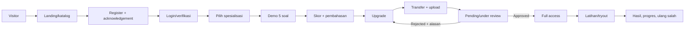
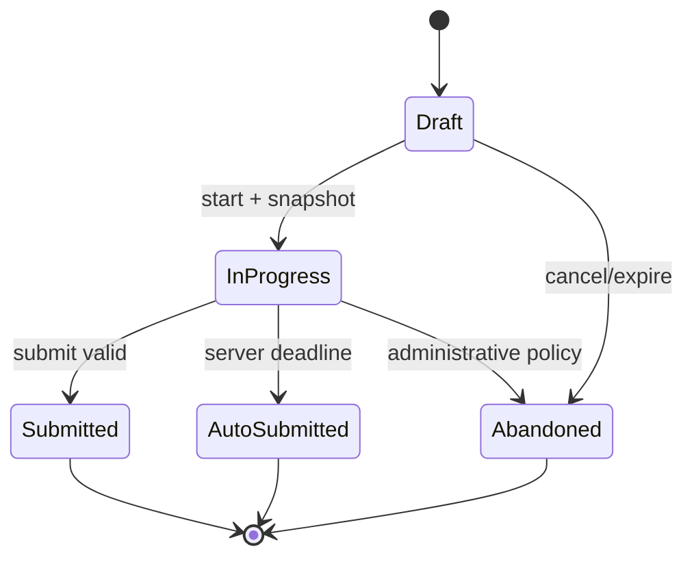
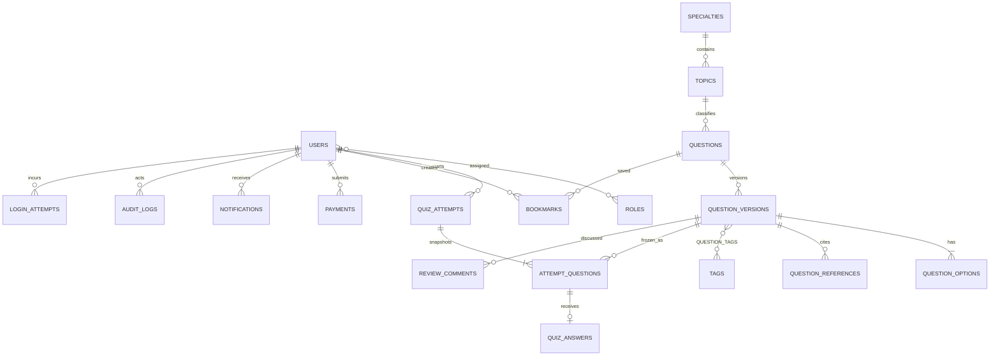

# Product Requirements Document (PRD) — Sinaesta

## 1. Identitas Dokumen

| Atribut | Nilai |
|---|---|
| Produk | **Sinaesta** |
| Kategori | Education technology bidang kedokteran |
| Tagline | “Platform Latihan Soal #1 untuk Dokter Spesialis” |
| Versi dokumen | 1.0 |
| Status | Draft untuk persetujuan stakeholder |
| Pemilik dokumen | Product Owner Sinaesta |
| Audiens | Stakeholder, UI/UX, frontend, backend, database, QA, DevOps, support, finance, legal/privacy |
| Teknologi wajib | React + Vite + React Router + Tailwind CSS; PHP native 8.2+ REST API; PDO; MySQL/MariaDB |
| Model bisnis MVP | Demo gratis; akses penuh sekali bayar Rp50.000, berlaku selamanya; transfer dan verifikasi manual |
| Tanggal baseline | 24 Agustus 2026 |

### 1.1 Riwayat revisi

| Versi | Tanggal | Penulis/pemilik | Perubahan | Status |
|---|---|---|---|---|
| 1.0 | 24-08-2026 | Product Owner | Baseline kebutuhan produk end-to-end | Menunggu sign-off |

### 1.2 Konvensi

- **MVP** adalah cakupan minimum yang wajib lolos kriteria peluncuran; **post-MVP** bukan komitmen tanggal.
- Prioritas memakai MoSCoW: **Must**, **Should**, **Could**, **Won’t Have for Now**.
- “Selamanya” berarti selama layanan Sinaesta beroperasi dan akun tidak melanggar ketentuan; redaksi final perlu persetujuan legal.
- Status **aktif** adalah flag operasional, sedangkan status editorial menunjukkan kematangan konten.
- Seluruh angka target pada PRD adalah **baseline hipotesis**, bukan hasil riset pasar, dan harus dikalibrasi setelah data nyata tersedia.

## 2. Executive Summary

Sinaesta adalah bank soal interaktif untuk 29 spesialisasi kedokteran di Indonesia. Produk menggabungkan clinical vignette, pembahasan evidence-based, referensi yang dapat diverifikasi, kuis bertimer, riwayat, analisis kelemahan, bookmark, dan tryout. Pengguna sasaran ialah dokter umum yang mempersiapkan seleksi pendidikan dokter spesialis, dokter residen, serta dokter yang ingin mengulang kompetensi klinis. Pengelola konten terdiri dari admin, editor, dan reviewer medis.

Value proposition Sinaesta adalah **“Bank soal latihan interaktif untuk 29+ spesialisasi kedokteran di Indonesia dengan clinical vignette, pembahasan evidence-based, tracking progres, dan tryout.”** Pengguna dapat mengevaluasi kualitas lewat demo lima soal per spesialisasi, lalu membeli akses penuh Rp50.000 melalui transfer manual. Produk merupakan alat belajar, bukan ujian resmi, sarana diagnosis, atau jaminan kelulusan.

MVP dinilai berhasil apabila pengguna dapat menemukan spesialisasi, menyelesaikan demo, melakukan upgrade, memperoleh akses setelah verifikasi, menjalankan attempt tanpa kehilangan jawaban, dan membaca hasil; sementara tim internal dapat mengelola konten dengan review, memverifikasi pembayaran, dan mengaudit tindakan kritis. Keamanan jawaban, data pribadi, upload, dan otorisasi merupakan launch blocker.

### 2.1 Disclaimer wajib

> **“Sinaesta adalah platform latihan soal dan alat belajar mandiri. Soal-soal dalam platform ini bukan ujian resmi dari Kolegium atau Konsil Kedokteran Indonesia. Penggunaan platform ini sepenuhnya sebagai tambahan latihan dan tidak menjamin kelulusan ujian resmi apa pun.”**

Disclaimer ditampilkan utuh pada landing page, footer, halaman registrasi (dengan acknowledgement), detail paket, modal wajib sebelum kuis pertama, serta Syarat dan Ketentuan. Footer boleh menampilkan versi ringkas yang menaut ke versi utuh, tanpa mengubah makna.

## 3. Latar Belakang

### 3.1 Konteks dan dampak

Soal latihan tersebar di PDF, grup percakapan, buku, dan sumber informal. Format tersebut sering tidak memiliki pembahasan, asal ilmiah, pencarian, timer, atau pencatatan progres. Dampaknya: waktu belajar habis untuk mengumpulkan materi; pengguna tidak dapat membedakan miskonsepsi dari kelemahan topik; pengalaman mobile buruk; dan pengelola tidak mempunyai proses terukur untuk menjaga mutu serta pembaruan referensi.

### 3.2 Existing alternatives

| Alternatif | Kelebihan | Keterbatasan/kesenjangan |
|---|---|---|
| PDF/buku soal | Familiar, dapat dipakai offline | Statis, progres manual, pembahasan/referensi tidak konsisten |
| Grup belajar/percakapan | Diskusi cepat | Sulit dicari, validitas bergantung anggota, tidak terstruktur |
| Flashcard/aplikasi kuis generik | Interaktif dan repetitif | Tidak spesifik konteks Indonesia; workflow medis/reviewer terbatas |
| Bimbingan/kursus | Arahan pengajar | Jadwal dan biaya lebih tinggi; cakupan bervariasi |
| Bank soal spesialisasi tertentu | Konten lebih fokus | Cakupan lintas 29 spesialisasi dan analitik belum tentu tersedia |

Pernyataan di atas adalah pemetaan hipotesis produk, bukan klaim riset kompetitor. Discovery wajib menguji alternatif yang benar-benar digunakan responden.

### 3.3 Kesenjangan dan peluang

Peluang Sinaesta ialah satu pengalaman terstruktur dan terjangkau yang menghubungkan konten terkurasi, latihan cepat, bukti referensi, dan umpan balik progres lintas spesialisasi. Relevansi berasal dari pola belajar dokter yang membutuhkan sesi fleksibel, kasus klinis yang kontekstual, dan informasi kelemahan yang dapat ditindaklanjuti.

### 3.4 Asumsi awal yang perlu divalidasi

| ID | Asumsi | Cara validasi | Sinyal keputusan |
|---|---|---|---|
| ASM-01 | Cakupan 29 spesialisasi meningkatkan minat | Wawancara dan analisis pilihan landing | Distribusi minat tidak hanya terkonsentrasi ekstrem |
| ASM-02 | Rp50.000 sekali bayar diterima dan berkelanjutan | Tes willingness-to-pay dan unit economics | Konversi serta biaya editorial memenuhi ambang stakeholder |
| ASM-03 | Lima soal cukup menilai kualitas | Usability test dan funnel demo | Pembahasan dilihat dan niat upgrade terukur |
| ASM-04 | Transfer manual tidak menurunkan konversi secara material | Funnel mulai bayar→approved, wawancara drop-off | Drop-off dalam toleransi baseline |
| ASM-05 | Pengguna mempercayai pembahasan dengan referensi | Wawancara serta survei pasca-kuis | Skor kepercayaan dan kelengkapan referensi naik |
| ASM-06 | Dokter akan belajar dalam sesi singkat via mobile | Diary study/analytics | Mayoritas attempt berhasil pada viewport mobile |
| ASM-07 | Reviewer tersedia untuk semua spesialisasi | Rekrutmen dan capacity planning | SLA review realistis per spesialisasi |
| ASM-08 | Akses “selamanya” aman secara legal/finansial | Review legal dan proyeksi biaya | Ketentuan layanan dan liability disepakati |

## 4. Problem Statement

**Dokter yang belajar untuk seleksi atau evaluasi spesialis membutuhkan latihan klinis yang relevan, terpercaya, mudah diakses, dan terukur; saat ini materi tersebar, sering tanpa pembahasan/referensi serta tanpa mekanisme untuk mengetahui kelemahan.** Sinaesta harus mengurangi friksi dari penemuan soal sampai tindakan belajar berikutnya tanpa menyiratkan afiliasi ujian resmi atau hasil kelulusan.

## 5. Product Vision

Menjadi platform latihan mandiri kedokteran spesialis yang paling mudah digunakan dan dipercaya di Indonesia, dengan konten yang dapat ditelusuri sumbernya dan insight belajar yang membantu pengguna menentukan fokus berikutnya.

### 5.1 Prinsip produk

1. **Clinical quality before quantity:** publikasi melewati review manusia yang kompeten.
2. **Fast path to practice:** pengguna dapat mulai latihan dengan langkah minimum.
3. **Progress is durable:** jawaban tersimpan, status jelas, hasil reproducible.
4. **Explain, not merely score:** hasil selalu mengarahkan pada pembelajaran.
5. **Secure by design:** jawaban benar, bukti bayar, dan data pengguna tidak diekspos sembarang.
6. **Honest positioning:** tidak ada klaim ujian resmi atau jaminan kelulusan.

## 6. Tujuan dan Non-Goals

### 6.1 Tujuan

| Dimensi | Tujuan SMART/baseline hipotesis |
|---|---|
| Bisnis | Dalam 90 hari setelah peluncuran terkontrol, mengukur funnel penuh dan mencapai ≥5% free-to-paid dari pengguna gratis eligible; target harus ditinjau setelah 30 hari data. |
| Pengguna | ≥60% pengguna baru yang login menyelesaikan demo pertama dalam 24 jam, dan ≥70% penyelesai demo membuka sedikitnya satu pembahasan. |
| Operasional | ≥90% pembayaran valid mendapat keputusan dalam 1 hari kerja; ≥95% soal published memiliki referensi dan tahun yang lengkap pada launch. |
| Teknis | ≥99,5% availability bulanan API di luar maintenance; p95 endpoint baca utama ≤800 ms pada beban baseline; autosave terkonfirmasi ≤2 detik pada jaringan normal. |
| Jangka pendek (0–3 bulan relatif) | Memvalidasi masalah, meluncurkan alur demo→bayar→belajar, 29 spesialisasi tersedia sebagai taksonomi, dan bank soal prioritas layak pakai. |
| Jangka menengah (3–9 bulan relatif) | Memperdalam jumlah/kualitas soal, analitik, SLA editorial, transactional email, serta menguji payment gateway dan study plan. |
| Jangka panjang (9+ bulan relatif) | Paket institusi, PWA/mobile, spaced repetition, simulasi khusus, dan skala konten dengan governance medis matang. |

Target bukan bukti kelulusan dan tidak boleh dipakai untuk korelasi kausal dengan ujian resmi tanpa studi yang tepat.

### 6.2 Non-goals MVP

- Bukan platform ujian resmi kolegium; tidak menjamin kelulusan atau menerbitkan sertifikat kompetensi resmi.
- Bukan sarana diagnosis/konsultasi pasien atau pengganti guideline, buku teks, dan pendidikan formal.
- Tidak ada payment gateway, aplikasi native Android/iOS, video conference/kelas langsung, atau forum publik.
- Tidak ada AI untuk menetapkan kebenaran klinis otomatis dan tidak ada publikasi soal buatan pengguna tanpa review.
- Tidak ada gamification, leaderboard publik, paket institusi, kode promo, import lanjutan, dark mode, atau workflow reviewer multi-level pada MVP.

Alasannya ialah menjaga fokus pada validasi pembelajaran, keamanan, mutu konten, dan monetisasi dasar sebelum menambah biaya serta kompleksitas moderasi/operasional.

## 7. Stakeholder

| Stakeholder | Kepentingan | Kebutuhan | Tanggung jawab | Pengaruh | Risiko/konflik |
|---|---|---|---|---|---|
| Product Owner | Outcome, scope, viability | Data funnel, keputusan jelas | Prioritas, acceptance, sign-off | Tinggi | Kecepatan vs kualitas klinis |
| Administrator | Operasi platform | Tool aman dan efisien | User, konten, setting, audit | Tinggi | Hak terlalu luas |
| Editor soal | Produktivitas konten | Form, versioning, komentar | Menulis/revisi soal | Sedang | Target volume vs mutu |
| Reviewer medis | Akurasi ilmiah | Referensi, checklist, COI | Review/approve/reject | Tinggi | Konflik kepentingan; bottleneck |
| User gratis | Evaluasi produk | Demo representatif, transparansi | Mematuhi ketentuan | Sedang | Penyalahgunaan demo |
| User full access | Nilai belajar berkelanjutan | Konten, progres, reliabilitas | Penggunaan wajar | Tinggi | Ekspektasi “selamanya” |
| UI/UX | Usability/aksesibilitas | Prioritas, flow, states | Riset, desain, handoff | Sedang | Estetika vs keterbacaan |
| Frontend | Contract stabil | API, state/error definitions | SPA aman/responsif | Sedang | Menaruh logika otoritatif di client |
| Backend | Integritas domain | BR, API, auth, concurrency | API, rules, security | Tinggi | Scope/technical debt |
| DBA | Integritas/performa data | Model, volume, retention | Index, migration, backup | Tinggi | Retensi vs privasi/biaya |
| QA | Kualitas rilis | AC teruji, environment | Test, regression, evidence | Tinggi | Waktu testing terpotong |
| DevOps | Reliability/deployment | Runbook, secrets, metrics | CI/CD, monitoring, restore | Tinggi | Hosting lintas origin |
| Customer support | Resolusi pengguna | Status/audit dan SOP | Triage, komunikasi | Sedang | Akses data berlebihan |
| Finance/pemeriksa | Validasi pembayaran | Bukti terlindungi, rekonsiliasi | Review dan keputusan | Tinggi | Fraud/salah approval |
| Legal/privacy | Kepatuhan dan klaim | Inventaris data, retention, copy | Review kebijakan/insiden | Tinggi | Growth vs minimisasi data |

RACI rinci dibuat per epic saat planning; keputusan medis tidak boleh diambil Product Owner tanpa reviewer berwenang.

## 8. Persona

| Persona | Profil, tujuan & motivasi | Kendala/kebiasaan digital | Kebutuhan & pain points | Skenario, pendorong upgrade, indikator sukses |
|---|---|---|---|---|
| P1 — Penjelajah seleksi | Dokter baru mulai; ingin memetakan kesiapan dan pilihan spesialisasi | Belajar sporadis, mencari via ponsel, belum punya kurikulum | Orientasi, contoh kualitas, hasil mudah dipahami; materi tersebar | Mencoba demo beberapa spesialisasi; upgrade bila cakupan dan pembahasan meyakinkan; sukses bila menetapkan fokus berikutnya |
| P2 — Kandidat terfokus | Sudah memilih spesialisasi; ingin latihan topik intensif | Membandingkan sumber/referensi; target rutin | Filter topik/kesulitan, soal salah, analitik; frustrasi pada soal ambigu | Latihan topik→review salah→ulang; upgrade karena kedalaman; sukses bila akurasi topik dan konsistensi membaik |
| P3 — Dokter sibuk | Jadwal klinis padat; ingin sesi singkat yang aman dilanjutkan | Mobile-first, koneksi berpindah, sering terinterupsi | Autosave, resume, status jelas; takut progres hilang | Memulai 10 soal, refresh/offline, lanjut; upgrade karena fleksibilitas; sukses bila menyelesaikan sesi tanpa kehilangan jawaban |
| P4 — Evaluator gratis | Belum yakin kredibilitas/nilai uang | Memindai landing, FAQ, harga; sensitif friksi transfer | Demo representatif, disclaimer/harga transparan, pembahasan bersumber | Menyelesaikan demo dan membuka pricing; upgrade bila trust dan manfaat terbukti; sukses bila membuat keputusan informed |
| P5 — Pengelola medis | Admin/editor/reviewer yang menjaga bank soal | Desktop-heavy, bekerja dalam antrean dan checklist | Workflow, versioning, audit, pencarian; risiko salah publish/COI | Editor submit, reviewer komentar, admin publish; sukses bila SLA dan checklist terpenuhi tanpa kehilangan jejak |

Tidak ada demografi spekulatif; persona wajib diperbarui melalui discovery.

## 9. Jobs to Be Done

| ID | Situasi—motivasi—outcome |
|---|---|
| JTBD-01 | Ketika menjelajah bidang, saya ingin membandingkan spesialisasi dan topik agar dapat memilih fokus belajar. |
| JTBD-02 | Ketika mendalami topik, saya ingin soal relevan dengan tingkat kesulitan terpilih agar waktu belajar terarah. |
| JTBD-03 | Ketika menguji kesiapan, saya ingin tryout acak 20 soal bertimer agar dapat berlatih dalam kondisi konsisten. |
| JTBD-04 | Ketika jawaban saya salah, saya ingin mengumpulkan dan mengulangnya agar miskonsepsi berkurang. |
| JTBD-05 | Ketika selesai menjawab, saya ingin pembahasan dan sumber yang dapat diverifikasi agar memahami alasan klinis. |
| JTBD-06 | Ketika belajar berkala, saya ingin melihat progres per topik agar menentukan prioritas berikutnya. |
| JTBD-07 | Ketika menemukan soal penting, saya ingin menyimpannya agar mudah dipelajari kembali. |
| JTBD-08 | Ketika demo meyakinkan, saya ingin membeli akses dengan status transparan agar segera memakai seluruh fitur. |
| JTBD-09 | Ketika memeriksa transfer, saya ingin data/bukti dan jejak keputusan lengkap agar approval akurat dan dapat direkonsiliasi. |
| JTBD-10 | Ketika mengelola bank soal, saya ingin membuat, meninjau, merevisi, dan menerbitkan versi terkontrol agar mutu klinis terjaga. |

## 10. Scope

### 10.1 MVP

Landing page; register/login/logout; forgot/reset password; profil; 29 spesialisasi dan topik; demo lima soal; kuis spesialisasi/topik; timer, navigasi, autosave, submit dan scoring; hasil/pembahasan; riwayat/statistik dasar; bookmark; tryout acak 20 soal; pembayaran manual/upload/verifikasi; notifikasi in-app; panel admin untuk pengguna, taksonomi, soal, review, pembayaran, setting, dan audit.

### 10.2 Post-MVP

Payment gateway, email transactional, personalized study plan, spaced repetition, simulasi khusus, analitik lanjut, institusi, promo, import lanjut, workflow reviewer dua tingkat, PWA, dark mode, gamification, leaderboard privat, dan aplikasi mobile.

### 10.3 Out of scope versi awal

Ujian/sertifikat resmi, konsultasi pasien, kelas sinkron, forum, AI clinical adjudication, marketplace soal, native app, dan leaderboard publik tidak dibuat karena risiko regulasi/medis, moderasi, biaya, atau belum diperlukan untuk menguji proposisi inti.

### 10.4 Katalog 29 spesialisasi

1. Anestesiologi; 2. Bedah Plastik; 3. Bedah Saraf; 4. Bedah Umum; 5. Dermatologi dan Venereologi; 6. Farmakologi Klinik; 7. Kedokteran Forensik dan Medikolegal; 8. Gizi Klinik; 9. Ilmu Kedokteran Masyarakat; 10. Ilmu Kesehatan Anak; 11. Ilmu Penyakit Dalam; 12. Jantung dan Pembuluh Darah; 13. Kedokteran Fisik dan Rehabilitasi; 14. Kedokteran Keluarga; 15. Kedokteran Okupasi; 16. Kedokteran Penerbangan; 17. Mata; 18. Mikrobiologi Klinik; 19. Neurologi; 20. Obstetri dan Ginekologi; 21. Onkologi Radiasi; 22. Orthopaedi dan Traumatologi; 23. Patologi Anatomi; 24. Patologi Klinik; 25. Psikiatri; 26. Pulmonologi dan Kedokteran Respirasi; 27. Radiologi; 28. THT-KL; 29. Urologi.

Setiap record memiliki nama unik, slug unik stabil, deskripsi, ikon dari allowlist, token warna yang memenuhi kontras, status, urutan, relasi topik, jumlah soal aktif, jumlah pengguna unik yang pernah attempt, dan agregat performa. Jumlah dan statistik dihitung backend/database (live atau tabel agregat/materialized job), **tidak hard-coded di frontend**. Spesialisasi tanpa soal boleh tampil “Segera tersedia” dan tidak menawarkan start.

## 11. Paket dan Hak Akses

### 11.1 Ketentuan demo

Demo Rp0 berisi maksimal lima soal published/aktif, satu attempt terselesaikan per spesialisasi per akun. Attempt in-progress dapat dilanjutkan; abandoned tidak menghabiskan kuota bila belum ada jawaban, sedangkan submitted/auto-submitted menghabiskan kuota. Admin dapat mereset kuota dengan alasan teraudit. Pencegahan abuse utama: akun terautentikasi, email unik, rate limit, session/device signals yang proporsional, dan pemantauan pola—bukan fingerprint invasif. Keputusan apakah email verification wajib masih open question; rekomendasi MVP: wajib sebelum demo untuk kontrol abuse, dengan perhatian pada conversion.

### 11.2 Matriks hak akses

| Kapabilitas | Visitor | Gratis | Pending | Full | Suspended | Admin | Editor | Reviewer |
|---|---:|---:|---:|---:|---:|---:|---:|---:|
| Lihat publik/katalog | ✓ | ✓ | ✓ | ✓ | ✓ | ✓ | ✓ | ✓ |
| Demo 1×/spesialisasi | – | ✓ | ✓ | ✓* | – | sesuai akun | sesuai akun | sesuai akun |
| Latihan unlimited/tryout | – | – | – | ✓ | – | sesuai entitlement | sesuai entitlement | sesuai entitlement |
| Riwayat/statistik penuh/bookmark | – | terbatas | terbatas | ✓ | baca profil saja | sesuai entitlement | sesuai entitlement | sesuai entitlement |
| Ajukan pembayaran | – | ✓ | tidak (pending aktif) | – | – | – | – | – |
| Kelola user/taksonomi/setting | – | – | – | – | – | ✓ | – | – |
| Buat/edit draft soal | – | – | – | – | – | ✓ | ✓ | terbatas komentar |
| Review/approve | – | – | – | – | – | ✓** | – | ✓ |
| Publish/archive | – | – | – | – | – | ✓ | – | – |
| Verifikasi pembayaran/audit | – | – | – | – | – | ✓ berizin | – | – |

\* Full access tidak dibatasi kuota demo. \** Admin hanya boleh approve jika ditetapkan sebagai reviewer kompeten dan tidak memiliki konflik; idealnya pembuat tidak menyetujui soal sendiri.

## 12. User Journey



### 12.1 Visitor menjadi pengguna gratis

Visitor membuka landing, memahami manfaat/disclaimer dan 29 spesialisasi, memilih daftar, mengisi nama, email, password, persetujuan Terms/Privacy/disclaimer, menyelesaikan verifikasi email bila diaktifkan, login, memilih spesialisasi, membaca instruksi, mengerjakan demo, lalu melihat skor/pembahasan. Drop-off form dipantau tanpa merekam password.

### 12.2 Upgrade

User membuka pricing, melihat harga/rekening/instruksi/refund policy, transfer Rp50.000, mengisi pengirim/bank/tujuan/nominal/tanggal/catatan, upload bukti, mengonfirmasi, lalu melihat status pending. Admin mengklaim pemeriksaan secara atomik, memilih approve/reject; user mendapat notifikasi. Approval mengaktifkan entitlement dalam transaksi yang sama; rejection menyertakan alasan dan memungkinkan pengajuan baru.

### 12.3 Mengikuti kuis

User memilih spesialisasi→topik→kesulitan→jumlah yang tersedia, membaca instruksi/durasi, lalu start. Sistem membuat snapshot attempt dan server deadline; user menjawab, menavigasi, mark/bookmark, autosave, dan submit melalui dialog ringkasan unanswered. Setelah submit idempotent, hasil menampilkan skor, benar/salah, analisis topik, pembahasan/referensi, serta aksi ulang atau latihan salah. Tryout selalu 20 jika stok memenuhi.

### 12.4 Admin menerbitkan soal

Editor membuat draft; mengisi vignette, stem, opsi A–E, satu kunci, pembahasan, objective, pearl, referensi, metadata; menjalankan checklist; submit review. Reviewer bebas COI memeriksa, berkomentar, lalu meminta revisi atau approve. Admin menerbitkan approved version; seluruh transisi/version/aktor/waktu diaudit. Soal yang outdated diarsipkan tanpa merusak historical attempt.

## 13. Sitemap dan Arsitektur Halaman

### 13.1 Sitemap

```mermaid
flowchart TD
  PUB[Publik] --> LP[Landing]
  PUB --> SPC[Daftar/detail spesialisasi]
  PUB --> INFO[Harga · FAQ · Tentang · Kontak]
  PUB --> LEGAL[Privacy · Terms · Disclaimer]
  AUTH[Auth] --> LG[Login · Register]
  AUTH --> PW[Forgot · Reset · Verify]
  USER[Pengguna] --> UD[Dashboard]
  USER --> LEARN[Spesialisasi · Topik · Setup · Quiz · Hasil]
  USER --> REC[Riwayat · Statistik · Bookmark]
  USER --> ACC[Pembayaran · Notifikasi · Profil]
  ADMIN[Admin] --> AD[Dashboard · Pengguna]
  ADMIN --> CONTENT[Spesialisasi · Topik · Soal · Review]
  ADMIN --> OPS[Pembayaran · Audit · Pengaturan]
```



### 13.2 Spesifikasi halaman

Singkatan state: **E** empty memberi konteks dan CTA; **L** skeleton yang mempertahankan layout; **X** pesan aman + retry/reference ID. Semua halaman responsif; tabel admin menjadi cards/scroll dengan aksi tetap terjangkau di mobile.

| Halaman | Tujuan/aktor | Informasi & aksi utama | E / L / X | Pertimbangan mobile |
|---|---|---|---|---|
| Landing | Semua; menjelaskan nilai | Hero, statistik berlabel, masalah/solusi, spesialisasi, cara kerja, harga, FAQ, CTA, disclaimer/footer | N/A / skeleton cards / fallback CTA | CTA ringkas, konten tidak horizontal |
| Daftar spesialisasi | Semua; discovery | Search/filter, status, jumlah soal dinamis; buka detail | “Tidak ditemukan” / cards / retry | Filter sheet, touch target |
| Detail spesialisasi | Semua | Deskripsi, topik, jumlah soal, progress bila login; mulai demo/latihan | Belum ada soal / skeleton / retry | CTA sticky tidak menutup konten |
| Harga | Semua | Demo vs full, Rp50.000, ketentuan, disclaimer; upgrade | N/A / skeleton / instruksi support | Tabel menjadi cards |
| FAQ/Tentang/Kontak | Semua | Informasi, kanal support | Kontak belum tersedia / text skeleton / fallback | Tipografi terbaca |
| Privacy/Terms/Disclaimer | Semua | Dokumen versi/tanggal; acknowledge bila perlu | N/A / skeleton / cached fallback | Daftar isi anchor |
| Login/Register | Visitor | Credentials, consent, forgot; submit | N/A / spinner tombol / inline+summary | Keyboard tepat, password toggle |
| Forgot/Reset/Verify | Visitor/user | Email/token/status; kirim/ulang | Generic sent / spinner / aman tanpa enumerasi | Deep link mudah dipakai |
| Dashboard user | User | Entitlement, KPI, progress, aktivitas, rekomendasi, chart; lanjut | Onboarding CTA / skeleton / partial retry | KPI cards, chart accessible summary |
| Spesialisasi/Topik | User | Search/filter/progress/difficulty; pilih | Belum ada/hasil nol / skeleton / retry | Filter bottom sheet |
| Quiz setup | User | Mode, topik, difficulty, count/duration terkontrol; start | Stok kurang / validating / koreksi | Satu kolom, instruksi ringkas |
| Quiz | User | Vignette, stem, A–E, timer, navigator, marked/saved; answer/submit | N/A / initial skeleton / offline banner | Stem lebar nyaman; navigator drawer; sticky actions |
| Hasil | Pemilik attempt | Score, breakdown, pembahasan/referensi; ulang/salah | Hasil diproses / skeleton / retry | Accordion per soal |
| Riwayat | User | Filter, status, skor, tanggal; buka/resume | Belum ada attempt + CTA / rows / retry | Cards + pagination |
| Statistik | Full | Metrik dan trend; filter periode/topik | Data minimum belum cukup / chart skeleton / explanation | Chart punya tabel/teks |
| Bookmark | Full | Soal tersimpan; buka/hapus/latihan | Belum ada + cara bookmark / skeleton / retry | Swipe tidak jadi satu-satunya aksi |
| Pembayaran | User | Instruksi/form/status/timeline; upload/ajukan | Belum ada pengajuan / skeleton / validation/support | File picker/camera, progress upload |
| Notifikasi | User | Daftar unread/read; buka/mark read | Tidak ada notifikasi / skeleton / retry | Infinite scroll/pagination aman |
| Profil | User | Identitas, password, preferensi, hapus akun; simpan | N/A / form skeleton / inline error | Field satu kolom |
| Admin dashboard | Admin | KPI operasi, antrean; buka task | Tak ada antrean / skeleton / partial errors | Ringkasan, desktop recommended |
| Admin pengguna | Admin | Search/filter/status/role/entitlement; lihat/ubah | Nol hasil / table skeleton / retry | Cards/scroll, konfirmasi kritis |
| Admin spesialisasi/topik | Admin | CRUD aman, urutan/status/count; simpan/archive | Belum ada / skeleton / conflict error | Reorder alternatif non-drag |
| Admin soal | Admin/editor | Queue, filter, draft/version; create/edit/submit | Tak ada soal / skeleton / conflict | Form panjang autosave; desktop recommended |
| Review soal | Reviewer/admin | Diff, checklist, references, COI, komentar; decide | Antrean kosong / skeleton / stale-version error | Side-by-side jadi stacked |
| Admin pembayaran | Admin/finance | Queue, protected proof, details/audit; claim/approve/reject | Antrean kosong / skeleton / concurrency conflict | Zoom bukti aman, explicit confirmation |
| Audit log | Admin auditor | Immutable events/filter/export terbatas; inspect | Belum ada event / rows / retry | Read-only cards |
| Pengaturan | Admin | Rekening, harga display, limits, maintenance; save | Defaults / skeleton / validation/conflict | Sectioned forms |
| 404 | Semua | Route tidak ditemukan; kembali/dashboard | N/A | N/A | CTA besar, tanpa leak route |

## 14. Functional Requirements

Semua acceptance criteria di kolom AC bersifat dapat diuji; detail bisnis merujuk BR terkait.

| ID | Modul | Requirement | Aktor | Prioritas | Dependensi | Acceptance criteria |
|---|---|---|---|---|---|---|
| LAND-001 | Landing | Navbar responsif menuju section/halaman | Visitor | Must | IA | Link aktif, keyboard operable, menu mobile dapat ditutup |
| LAND-002 | Landing | Hero, manfaat, CTA register/demo | Visitor | Must | Copy legal | CTA menuju tujuan benar dan klaim tidak menjanjikan lulus |
| LAND-003 | Landing | Statistik, masalah/solusi, cara kerja | Visitor | Should | API agregat | Statistik memiliki sumber/waktu atau tidak ditampilkan bila invalid |
| LAND-004 | Landing | Daftar 29 spesialisasi dinamis | Semua | Must | SPEC-001 | Tepat 29 seed; count berasal API; status jelas |
| LAND-005 | Landing | Harga, FAQ, CTA, footer dan disclaimer | Semua | Must | Legal | Harga Rp50.000 konsisten; disclaimer utuh tersedia |
| AUTH-001 | Auth | Registrasi email unik, password, consent | Visitor | Must | SEC-001 | Valid input membuat user gratis; duplikat memberi pesan aman; consent version tercatat |
| AUTH-002 | Auth | Login/logout dan secure session | User | Must | SEC-002 | Login valid regenerasi ID; logout invalidasi session |
| AUTH-003 | Auth | Forgot/reset password token sekali pakai | User | Must | Notification mechanism | Respons forgot generik; token hash, expiry, invalid setelah dipakai |
| AUTH-004 | Auth | Verifikasi email | User | Should* | Delivery email | Token sekali pakai; resend rate-limited; status tersimpan (*Must jika keputusan demo mensyaratkan) |
| AUTH-005 | Auth | Ubah password | User | Must | AUTH-002 | Memerlukan password saat ini; session lain dicabut sesuai kebijakan |
| AUTH-006 | Auth | Rate limit auth dan session expiry warning | Semua | Must | SEC-004 | Limit menghasilkan 429; client memperingatkan sebelum expiry tanpa memperpanjang diam-diam |
| DASH-001 | Dashboard | Status akses dan CTA kontekstual | User | Must | Entitlement | Gratis/pending/full/suspended tampil akurat |
| DASH-002 | Dashboard | Statistik, progres, aktivitas, chart skor | User | Must | attempts | Angka mengikuti rumus §19 dan filter konsisten |
| DASH-003 | Dashboard | Rekomendasi rule-based dan lanjut belajar | Full | Should | History | Menunjuk attempt in-progress/topik lemah; label bukan diagnosis/AI |
| SPEC-001 | Katalog | Daftar/detail/search/filter spesialisasi/topik | Semua | Must | taxonomy | Search case-insensitive; pagination; hanya record visible |
| SPEC-002 | Katalog | Progress/status pengerjaan/difficulty | User | Must | attempts | Status dihitung server dan tidak hard-coded |
| QUIZ-001 | Quiz | Membuat attempt sesuai entitlement/mode | User | Must | AUTH, catalog | Server validasi akses/stok dan snapshot question IDs |
| QUIZ-002 | Quiz | Pemilihan tanpa duplikat dan randomisasi | User | Must | question pool | Tidak ada question_id ganda; option order disimpan per attempt |
| QUIZ-003 | Quiz | Timer bersumber server | User | Must | clock | Response memberi deadline; expired auto-submit server-side |
| QUIZ-004 | Quiz | Autosave jawaban idempotent | User | Must | attempt | Upsert hanya attempt in-progress milik user; ack/version dikembalikan |
| QUIZ-005 | Quiz | Navigasi dan mark for review | User | Must | QUIZ-001 | Status answered/marked terlihat dan tersimpan setelah refresh |
| QUIZ-006 | Quiz | Bookmark | Full | Must | question | Toggle idempotent; unik user-question |
| QUIZ-007 | Quiz | Resume setelah refresh/koneksi putus | User | Must | autosave | State tersimpan dimuat; waktu offline tidak menghentikan deadline |
| QUIZ-008 | Quiz | Submit/auto-submit idempotent | User | Must | DB transaction | Request berulang mengembalikan hasil sama tanpa skor ganda |
| QUIZ-009 | Quiz | Penilaian server-side | User | Must | snapshot key | Client tidak menerima kunci sebelum selesai; score reproducible |
| RES-001 | Hasil | Skor, benar/salah/unanswered, waktu | Attempt owner | Must | submitted attempt | Total konsisten dan hanya pemilik/role berizin dapat melihat |
| RES-002 | Hasil | Pembahasan, referensi, analisis topik | Attempt owner | Must | question version | Menggunakan versi saat attempt; link aman; alasan opsi tersedia sesuai konten |
| RES-003 | Hasil | Ulang kuis/latihan soal salah | Full | Must | history | Membuat attempt baru; attempt lama immutable |
| HIST-001 | Riwayat | List/filter/detail attempt | User | Must | attempts | Paginated; hanya milik sendiri; resume hanya in-progress |
| STAT-001 | Statistik | Metrik dasar dengan definisi baku | Full/admin | Must | aggregation | Formula, timezone, window dikembalikan metadata API |
| PAY-001 | Pembayaran | Instruksi rekening/harga dari setting backend | User | Must | settings | Harga Rp50.000 dan rekening aktif tampil tanpa secret |
| PAY-002 | Pembayaran | Draft/form/upload bukti aman | User | Must | secure storage | MIME JPG/PNG/WebP, ≤2 MB, random filename, protected access |
| PAY-003 | Pembayaran | Submit dan status timeline | User | Must | PAY-002 | Satu pending aktif; internal number unik; perubahan terlihat |
| PAY-004 | Pembayaran | Claim/review/approve/reject | Admin/finance | Must | RBAC | Concurrency dicegah; reject wajib alasan; actor/time tercatat |
| PAY-005 | Pembayaran | Aktivasi/reversal terkontrol | Admin berizin | Must | transaction/audit | Approval+entitlement atomik; reversal perlu alasan dan dual control yang direkomendasikan |
| NOTIF-001 | Notifikasi | In-app payment/system notifications | User | Must | events | Unread count benar; mark read idempotent; link terotorisasi |
| ADM-001 | Admin | Dashboard operasi | Admin | Must | aggregates | Queue dan KPI sesuai scope/permission |
| ADM-002 | Admin | Manajemen user, status, role, access | Admin | Must | RBAC/audit | Perubahan sensitif dikonfirmasi dan diaudit; tidak dapat eskalasi tanpa izin |
| ADM-003 | Admin | CRUD/archive spesialisasi/topik | Admin | Must | taxonomy | Unique slug; referenced row tidak hard-delete |
| ADM-004 | Admin | CRUD/versioning soal | Editor/admin | Must | editorial | Validasi A–E/satu kunci/referensi; optimistic lock |
| ADM-005 | Admin | Reviewer workflow | Reviewer/admin | Must | versions | Transisi sesuai state machine; COI dan komentar tersimpan |
| ADM-006 | Admin | Payment verification | Finance/admin | Must | PAY | Bukti via signed/authenticated route; keputusan atomik |
| ADM-007 | Admin | Settings | Admin | Must | audit | Allowlist key/type; perubahan harga/rekening diaudit |
| ADM-008 | Admin | Audit log read-only | Auditor/admin | Must | audit writer | Filter/pagination; tidak tersedia delete/update |
| SEC-001 | Security | RBAC dan object ownership setiap endpoint | Semua | Must | roles | Unauthorized 401/403; IDOR test tidak mengungkap objek |
| SEC-002 | Security | CSRF, CORS allowlist, secure cookies | Semua | Must | deployment | Mutasi tanpa token ditolak; origin liar ditolak; cookie flags benar |
| SEC-003 | Security | Server validation, escaping, prepared PDO | Semua | Must | backend | Payload invalid 422; XSS/SQLi tidak dieksekusi |
| SEC-004 | Security | Rate limit, brute-force control, audit | Semua | Must | login attempts | 429/generic response; event kritis tercatat tanpa secret |

## 15. Business Rules

| ID | Aturan yang dapat diuji | Edge case dan keputusan |
|---|---|---|
| BR-001 | User gratis hanya mengakses demo. | Deep link premium → 403 + CTA upgrade, bukan data parsial. |
| BR-002 | Satu demo maksimal lima soal dan satu completion per spesialisasi. | Resume tidak membuat attempt baru; stok <5 memakai stok tersedia dan diinformasikan. |
| BR-003 | Harga full access MVP tepat Rp50.000 sekali bayar. | Setting berubah harus versioned; pengajuan menyimpan price snapshot. |
| BR-004 | Full access aktif hanya setelah Approved. | Approval bersamaan memakai lock/conditional update; satu pemenang. |
| BR-005 | Satu user maksimal satu payment Pending/Under Review aktif. | Draft boleh satu; rejected/cancelled memungkinkan baru; constraint/transaction mencegah race. |
| BR-006 | Rejection wajib alasan yang aman ditampilkan. | Alasan internal fraud dipisah dari user-facing reason. |
| BR-007 | Approval menyimpan admin pemeriksa dan waktu server. | Akun admin terhapus tetap direferensikan/di-soft-delete. |
| BR-008 | Hanya soal Published **dan** active masuk attempt baru. | Soal dinonaktifkan setelah start tetap ada dari version snapshot. |
| BR-009 | Kunci/pembahasan tidak dikirim sebelum attempt selesai. | DevTools/API langsung tetap hanya menerima option tanpa correctness. |
| BR-010 | Nilai dihitung backend dari frozen version/key. | Perubahan kunci masa depan tidak mengubah nilai historis; koreksi massal perlu prosedur terpisah. |
| BR-011 | Attempt selesai immutable. | Admin tidak mengedit jawaban; pembatalan akibat insiden menjadi event/attempt baru. |
| BR-012 | Submit idempotent dan satu nilai. | Timeout/ganda memakai idempotency key + unique result/conditional status. |
| BR-013 | User hanya melihat attempt sendiri. | ID acak maupun berurutan orang lain → 404/403 generik dan security log. |
| BR-014 | Audit log tidak dapat dihapus/diubah melalui aplikasi. | Retensi/arsip oleh DBA melalui prosedur legal terdokumentasi, bukan UI. |
| BR-015 | Soal yang pernah dipakai tidak hard-delete. | Archive/soft-delete; version historis tetap tersedia untuk hasil pemilik. |
| BR-016 | Suspended tidak dapat start/resume/submit kuis baru. | Jika suspension saat in-progress, jawaban tetap tersimpan; support menentukan close tanpa membuka akses. |
| BR-017 | Semua perubahan role/entitlement dicatat. | Rollback juga event baru, bukan overwrite jejak. |
| BR-018 | Count spesialisasi berasal dari soal Published+active. | Cache invalidated saat publish/archive; tampilkan timestamp bila agregat async. |
| BR-019 | Waktu server sumber timer. | Jam perangkat salah/offline tidak menambah waktu; grace jaringan maksimal terkonfigurasi dan teraudit. |
| BR-020 | Pembayaran, submit, publish, dan perubahan akses memakai transaksi DB. | Kegagalan parsial rollback; retry aman. |
| BR-021 | Opsi tepat A–E dan hanya satu benar pada MVP. | Draft boleh belum lengkap; submit review/publish menolak invalid. |
| BR-022 | Tryout memilih tepat 20 soal unik bila stok cukup. | Stok kurang: start ditolak dan jumlah tersedia ditampilkan; tidak diam-diam mengurangi. |
| BR-023 | Entitlement tidak berasal dari flag frontend. | Semua premium endpoint mengecek server pada setiap request. |
| BR-024 | Bookmark unik per user-question. | Toggle serentak berakhir satu record; archived question tetap terlihat berlabel atau dapat dihapus. |
| BR-025 | Penerbit tidak boleh mengabaikan checklist/refensi wajib. | Emergency publish hanya admin khusus dengan alasan dan audit; keputusan stakeholder. |

## 16. Spesifikasi Quiz Engine

### 16.1 Struktur dan metadata soal

Setiap versi soal memuat clinical vignette (tanpa data pasien teridentifikasi), pertanyaan/stem, lima opsi A–E, tepat satu jawaban benar, pembahasan umum dan alasan opsi (bila tersedia), learning objective, clinical pearl, minimal satu referensi, tahun referensi, DOI/URL opsional tervalidasi, difficulty (`easy|medium|hard`), tags, specialty, topic, status editorial, flag active, author/reviewer, serta timestamps/version number. Rich text menggunakan format yang disanitasi dan allowlist; gambar memiliki lisensi, alt text, dan penyimpanan aman.

### 16.2 Mode

| Mode | Pool dan hak | Jumlah/waktu |
|---|---|---|
| Demo | Pool demo curated per spesialisasi; user gratis | ≤5; durasi konfigurasi server |
| Latihan spesialisasi | Semua topik dalam spesialisasi; full | Pilihan count yang tidak melebihi stok |
| Latihan topik | Specialty+topic+difficulty opsional; full | Pilihan count |
| Acak | Filter eligible seluruh scope; full | Pilihan count |
| Pernah salah | Distinct question dari jawaban salah historis, versi published terbaru eligible | Hingga stok; full |
| Bookmark | Question bookmarked yang masih eligible | Hingga stok; full |
| Tryout | Acak unik lintas scope yang dipilih | Tepat 20; full; durasi tetap konfigurasi |

### 16.3 Siklus attempt

`Draft` (setup belum dimulai) → `In Progress` → `Submitted` atau `Auto-submitted`; `Abandoned` untuk attempt yang secara kebijakan ditutup tanpa penilaian. Status final immutable.



### 16.4 Algoritme dan persistensi

- Backend membangun pool `published AND active`, menerapkan entitlement/filter, mengacak dengan algoritme DB/aplikasi yang tidak bias pada skala wajar, mengambil ID unik, kemudian menyimpan urutan question dan option sebagai snapshot. Untuk skala besar, hindari `ORDER BY RAND()` penuh; gunakan kandidat terindeks/sampling.
- `attempt_questions` menyimpan question_version_id, sequence, option order, dan denominator sehingga perubahan editorial tidak mengubah attempt.
- Autosave melakukan upsert answer/marked dengan attempt version atau `updated_at`; konflik mengembalikan state terbaru. Client menampilkan `saving/saved/offline/failed` dan antrean lokal sementara tidak dianggap committed sebelum ACK.
- Resume memuat server deadline, urutan, jawaban/mark tersimpan, dan remaining time yang dihitung server. Refresh tidak menciptakan attempt.
- Saat offline, UI tetap dapat menampung pilihan secara lokal dan mencoba sinkronisasi; deadline terus berjalan. Saat kembali setelah deadline, backend auto-submit jawaban terakhir yang telah diterima; pilihan lokal terlambat ditolak dengan pesan jelas.
- Submit menggunakan `Idempotency-Key`, transaksi, conditional transition, locking yang tepat, serta unique result. Dua request memperoleh payload hasil identik.
- Skor MVP: `correct / total_questions × 100`, dibulatkan dua desimal; salah dan unanswered bernilai 0, tanpa negative marking. Detail count selalu disertakan.
- Pembahasan hanya tersedia setelah final dan memakai version snapshot. History disimpan selama akun aktif dan periode retention; penghapusan akun dianonimkan/dihapus sesuai §21 dan kewajiban audit.

## 17. Editorial Workflow

### 17.1 Hak dan transisi

- **Editor/admin** membuat Draft dan mengedit Draft/Revision Required miliknya atau yang ditugaskan.
- **Reviewer** melihat submitted version, mencatat deklarasi konflik kepentingan (COI), komentar field-level/general, dan memilih Revision Required atau Approved.
- **Admin/publisher** menerbitkan hanya Approved version atau mengarsipkan Published. Editor tidak publish sendiri pada baseline.
- Setiap submit membuat immutable `question_version`; revisi berikutnya bercabang dari versi terakhir. Optimistic locking mencegah overwrite paralel; diff menunjukkan perubahan.
- Komentar menyimpan version, field/anchor, author, timestamp, disposition, dan thread; komentar tidak hilang ketika resolved.
- Reviewer dengan keterlibatan penulisan, hubungan komersial, atau kompetensi tidak sesuai wajib recuse; assignment dialihkan dan dicatat.
- Referensi diperiksa keberadaan, relevansi, tahun, penerbit/jurnal, DOI/URL dan kesesuaian klaim. Guideline memiliki tanggal review berikutnya.
- Soal usang menjadi Archived; attempt lama tetap menunjuk versi historis. Pengganti diterbitkan sebagai versi/soal baru dengan alasan.

### 17.2 Checklist kualitas wajib sebelum approval

- [ ] Vignette jelas, relevan, dan tidak ambigu.
- [ ] Hanya satu jawaban terbaik; distractor masuk akal dan homogen.
- [ ] Pembahasan menjelaskan jawaban benar dan mengapa pilihan salah tidak terbaik.
- [ ] Learning objective dan clinical pearl konsisten.
- [ ] Referensi dapat diverifikasi; guideline/publikasi dan tahun tercatat.
- [ ] Tidak menyalin materi berhak cipta tanpa izin/atribusi.
- [ ] Tidak ada nama, tanggal lahir, nomor rekam medis, foto wajah, atau data pasien identifiable.
- [ ] Terminologi medis, satuan, bahasa, dan ejaan konsisten.
- [ ] Difficulty/topic/tag tepat; tautan/DOI valid.
- [ ] Reviewer menyatakan kompetensi dan COI.

## 18. Payment Workflow

### 18.1 Status dan data

`Draft → Pending → Under Review → Approved|Rejected`; Draft/Pending dapat menjadi `Cancelled` sesuai aturan. Record menyimpan user, nomor transaksi internal unik, snapshot paket/harga, nama pengirim, bank pengirim, rekening tujuan, nominal integer rupiah, tanggal transfer, storage key bukti, MIME/size/hash, status, catatan user, catatan admin internal dan user-facing, pemeriksa, claimed/reviewed timestamps, version, dan audit references.

### 18.2 Upload aman

Hanya JPG, PNG, WebP maksimal 2 MB. Backend memeriksa ukuran aktual, MIME dengan fileinfo, signature/decode gambar, menolak polyglot/ekstensi tidak cocok, re-encode bila disepakati, membuat nama random non-predictable, menyimpan di luar public web root/object private storage, menonaktifkan eksekusi, serta menyajikan via endpoint terautentikasi berizin dengan `Content-Disposition` dan `nosniff`. Upload berada di backend, bukan Vercel.

### 18.3 Exception dan rekonsiliasi

| Kasus | Tindakan |
|---|---|
| Bukti buram | Reject dengan alasan “bukti tidak terbaca” dan instruksi upload ulang; original tetap sesuai retention/audit |
| Nominal salah | Jangan approve otomatis; reject atau eskalasi kebijakan selisih/refund |
| Transfer duplikat | Bandingkan hash, nominal, nama, tanggal, referensi bank; tandai suspected duplicate tanpa menuduh user |
| Dugaan palsu | Under Review, batasi akses bukti, eskalasi finance; log internal tidak tampil ke user |
| Salah rekening | Reject/eskalasi support dengan instruksi; jangan klaim dana diterima |
| Dua admin review | Claim/version lock; admin kedua menerima 409 dan state terbaru |
| Salah approve | Tidak mengedit event lama; reversal baru beralasan, otorisasi lebih tinggi/dual control, notifikasi user |
| Pembatalan approval | Revoke entitlement hanya jika kebijakan/legal mengizinkan; attempt historis tetap; sesi premium berikutnya ditolak |
| Rekonsiliasi | Laporan per periode mencocokkan bank vs approved; selisih ditangani finance dan diaudit |

## 19. Dashboard dan Analytics

### 19.1 Rumus metrik pengguna

Semua metrik mengabaikan abandoned dan hanya memakai attempt final; demo/latihan/tryout dapat difilter terpisah. Waktu memakai UTC di storage dan zona tampilan pengguna.

| Metrik | Rumus/definisi | MVP |
|---|---|---:|
| Total kuis | count attempt Submitted + Auto-submitted | ✓ |
| Total soal dikerjakan | count answer dengan selected option pada attempt final | ✓ |
| Benar/salah | count answer dibanding frozen key; salah tidak termasuk unanswered | ✓ |
| Akurasi | benar / (benar+salah) ×100; N/A jika nol answered | ✓ |
| Rata-rata skor | mean skor attempt final, setiap attempt bobot sama | ✓ |
| Skor terbaik | max skor final dalam filter | ✓ |
| Total waktu belajar | sum clamp(`submitted_at-started_at`, 0, configured duration) | ✓ |
| Streak | hari kalender lokal berturut-turut hingga hari ini/kemarin dengan ≥1 attempt final | Should |
| Performa topik | benar / answered per topic; tampilkan sample size | ✓ |
| Grafik perkembangan | skor final menurut submitted_at; agregat harian/mingguan | ✓ |
| Terkuat/terlemah | max/min akurasi topic dengan minimum 5 answered; tie by sample then name | ✓ |
| Aktivitas terbaru | 10 event belajar terbaru yang diizinkan | ✓ |

### 19.2 Metrik admin

| Metrik | Definisi | MVP/Post |
|---|---|---|
| Total user | count non-deleted user accounts | MVP |
| User aktif | distinct user dengan login atau attempt dalam 30 hari; label window | MVP |
| Gratis/full | entitlement aktif pada snapshot waktu | MVP |
| Pending payment | Pending+Under Review saat ini | MVP |
| Total/published question | count logical question / Published+active current versions | MVP |
| Total attempt/rata-rata skor | final attempts / mean final score | MVP |
| Aktivitas harian | distinct active learners dan attempts per UTC/local business day | MVP |
| Pertumbuhan user | registrasi per periode dan perubahan vs periode setara | MVP |
| Distribusi spesialisasi | distinct attempters atau attempts per specialty; label definisi | Post-MVP (basic MVP optional) |
| Free-to-paid | distinct user approved pertama kali / eligible registered free cohort ×100 | MVP |
| Cohort/retention/LTV | Cohort calendar dan revenue longitudinal | Post-MVP |

Recommendation MVP bersifat rule-based: lanjutkan in-progress; bila tidak, topik dengan akurasi terendah dan sample ≥5; bila data kurang, topik populer/awal dengan label eksplorasi.

## 20. Non-Functional Requirements

| ID | Area | Target terukur/acceptance |
|---|---|---|
| NFR-PERF-01 | Web | LCP p75 ≤2,5 s, CLS ≤0,1, INP ≤200 ms pada halaman landing mobile target setelah optimasi produksi |
| NFR-PERF-02 | API | p95 GET utama ≤800 ms dan mutasi ≤1.200 ms pada baseline 50 request/detik, tidak termasuk upload |
| NFR-PERF-03 | Data | Semua list >50 row paginated (default 20, max 100); query filter/foreign key penting terindeks dan EXPLAIN ditinjau |
| NFR-PERF-04 | Asset | Route lazy-load; gambar responsive WebP/AVIF bila sesuai, size budget; tidak fetch semua soal sekaligus |
| NFR-REL-01 | Autosave | ACK p95 ≤2 s jaringan normal; retry exponential; kehilangan maksimum hanya edit yang belum pernah ACK |
| NFR-REL-02 | Submit | Idempotent dan atomic; 100 request key sama menghasilkan satu finalization |
| NFR-REL-03 | Availability | API monthly ≥99,5% di luar maintenance; health check tanpa secret |
| NFR-REL-04 | Backup | DB encrypted harian, retention 30 hari; RPO ≤24 jam, RTO ≤8 jam; restore drill triwulanan |
| NFR-SCALE-01 | Skalabilitas | API stateless sejauh mungkin; shared session store diperlukan saat multi-instance; pagination dan job agregat siap scale |
| NFR-MAIN-01 | Maintainability | Separation of concerns, naming konsisten, env config, API/DB/runbook terdokumentasi; migration reversible atau rollback plan |
| NFR-COMP-01 | Browser | Dua versi mayor terbaru Chrome, Edge, Firefox, Safari dan browser mobile modern diuji |
| NFR-OBS-01 | Observability | Structured logs dengan request ID, severity, endpoint, latency/status; tanpa password/token/bukti/answer key |
| NFR-OBS-02 | Monitoring | Alert 5xx >2% selama 5 menit, health failure, storage >80%, backup failure, queue payment aging |
| NFR-ACC-01 | Accessibility | WCAG 2.1 AA untuk alur kritis; keyboard-only dan screen-reader smoke test |
| NFR-DR-01 | Recovery | Runbook error recovery, rollback deploy, database restore, dan insiden lintas origin diuji sebelum launch |

## 21. Security dan Privacy

### 21.1 Kontrol wajib

- PDO prepared statements tanpa interpolasi input; `password_hash()`/`password_verify()` dengan rehash saat parameter berubah.
- Session server-side; regeneration pada login/perubahan privilege; idle/absolute timeout; cookie `HttpOnly`, `Secure`, dan `SameSite=None` bila benar-benar cross-site (atau `Lax` bila same-site), scope minimum.
- CSRF token untuk seluruh mutasi berbasis cookie; CORS exact allowlist, `credentials=true`, tanpa wildcard production.
- Server-side schema/domain validation, output escaping, sanitasi rich text, CSP, `X-Content-Type-Options`, `Referrer-Policy`, frame protection, HSTS setelah HTTPS stabil.
- Rate limit per IP+account pada login/reset/register/upload/start/submit; generic auth/production error; delay/lock proporsional dan login attempt logging.
- RBAC deny-by-default plus ownership query untuk mencegah IDOR; perubahan role/entitlement memerlukan izin khusus.
- Secure upload sesuai §18; malware scanning bila tersedia; bukti tidak masuk CDN/public URL.
- Audit event untuk auth risk, editorial, payment, access, role, setting, dan admin read bukti sensitif.

### 21.2 Klasifikasi, akses, dan retensi

| Kelas | Contoh | Akses | Retensi baseline (perlu legal sign-off) |
|---|---|---|---|
| Restricted | Password hash, reset token hash, session ID, bukti bayar | Sistem/ops minimum; bukti hanya finance berizin | Token sampai expiry+cleanup; session sampai expiry; bukti 2 tahun setelah keputusan lalu hapus, kecuali sengketa/hukum |
| Confidential | Email, nama, payment metadata, aktivitas detail | User sendiri; support/admin sesuai tugas | Selama akun aktif + maksimum 2 tahun operasional setelah deletion/anonymization |
| Internal | Audit, review comments, unpublished questions/keys | Role terkait | Audit minimum 5 tahun atau sesuai legal; konten sesuai lifecycle |
| Public | Specialty, published descriptive content, legal pages | Semua | Selama dipublikasikan/arsip |

Password plaintext, token/session/CSRF value, connection string, secret, raw bukti, answer key pre-submit, full request body auth/payment, dan data pasien **tidak boleh masuk log**. Backup dienkripsi, akses least privilege, restore dicatat, dan lifecycle penghapusan berlaku pula pada backup melalui expiry terjadwal.

### 21.3 Hak pengguna dan deletion

User dapat meminta ekspor/akses/koreksi dan penghapusan akun lewat flow terverifikasi. Sistem mencabut session, menghapus/anonymize profil dan aktivitas yang tidak wajib dipertahankan, memisahkan record finansial/audit yang wajib disimpan, dan memberi estimasi penyelesaian. Hard delete tidak boleh merusak integritas attempt/content; gunakan pseudonymization. Kebijakan final mengikuti hukum Indonesia dan review legal, bukan asumsi PRD.

### 21.4 Incident response dasar

Deteksi/triage → batasi akses/rotasi secret → simpan bukti forensik secara sah → nilai ruang lingkup/data → komunikasi internal dan notifikasi regulator/subjek bila diwajibkan → pulihkan/monitor → postmortem tanpa menyalahkan. Tetapkan incident commander, kanal, severity, daftar kontak, dan latihan tabletop.

Privacy-by-design berarti minimisasi form, purpose limitation, consent/versioning, private defaults, access review berkala, data dummy di non-production, dan DPIA untuk fitur berisiko. Konten medis membawa risiko outdated/misinterpretasi; tampilkan tanggal/referensi/disclaimer, report mechanism (post-MVP diprioritaskan), dan review berkala—bukan clinical advice.

## 22. Technical Constraints

```text
Pengguna
   ↓
Frontend React/Vite di Vercel
   ↓ HTTPS REST API
Backend PHP native 8.2+ di hosting PHP/cPanel/VPS
   ↓
MySQL/MariaDB
```

- Frontend wajib React, Vite, React Router, Tailwind CSS dan deploy Vercel.
- Backend wajib **PHP native 8.2+**, JSON REST API, PDO, MySQL/MariaDB pada hosting PHP/cPanel/VPS. PHP native bukan runtime utama di Vercel dan tidak diganti Node.js, Firebase, Supabase, Laravel, atau framework backend lain.
- Frontend/backend dipisah; konfigurasi frontend hanya `VITE_API_BASE_URL=https://api.sinaesta.id/api`. Secret, DB credential, signing key, dan rekening internal nonpublik tidak boleh berada di bundle/frontend.
- CORS production exact allowlist. Untuk session cookie lintas origin, frontend memakai credentials, API mengizinkan origin eksplisit+credentials, preflight benar, dan domain/Secure/SameSite cookie diuji pada Safari/mobile.
- Bukti bayar disimpan di backend/private storage, bukan Vercel frontend. API melakukan authorization sebelum streaming.
- API versioning direkomendasikan (`/api/v1`) sebelum kontrak publik stabil; waktu ISO-8601 UTC, ID opaque, JSON UTF-8.

## 23. Conceptual Data Model dan ERD

### 23.1 Kamus entitas

| Entitas | Tujuan & field utama | Relasi/constraint/index | Retensi/delete |
|---|---|---|---|
| Users | identity: id, email, password_hash, name, status, email_verified_at, timestamps | email unique; status/index; M:N roles | soft-delete/anonymize; hash tidak pernah diekspor |
| Roles | RBAC: id, code, name | code unique; M:N users | seed, tidak hard-delete bila dipakai |
| Specialties | taxonomy: name, slug, description, icon, color, status, sort_order | slug/name unique; status+order index | archive/soft-delete |
| Topics | child taxonomy: specialty_id, name, slug, status, order | unique(specialty,slug); FK/index | archive |
| Questions | logical item: topic, current_version, editorial/active | FK/index status/topic | archive; never hard-delete if used |
| Question options | version options A–E, text, is_correct | unique(version,label); exactly one correct enforced app/transaction | immutable with version |
| Question references | citation/year/DOI/URL | version FK; DOI index optional | immutable/versioned |
| Tags | controlled labels | slug unique | archive/merge procedure |
| Question tags | junction version/question-tag | composite unique/index | follows version |
| Quiz attempts | user, mode, status, start/deadline/submit, score, idempotency | user+status/date indexes; opaque id | retain/anonymize per policy |
| Attempt questions | frozen question_version/order/option_order | unique(attempt,sequence), unique(attempt,question) | immutable after start |
| Quiz answers | selected option, marked, saved_at/version | unique(attempt_question); ownership through attempt | immutable after final |
| Bookmarks | user-question timestamps | unique(user,question) | hard-delete on toggle/account deletion |
| Payments | snapshot transaction, amount, status, proof key, reviewer | transaction_no unique; one active pending/user via transaction/constraint strategy | restricted retention; no routine hard-delete |
| Notifications | user,type,title,body/link,read_at | user+read_at+created index | delete after 1 year baseline |
| Settings | allowlisted key, typed value, version | key unique | retain audit/history |
| Audit logs | actor/action/target/before-after redacted/request id/time | actor,target,time indexes; append-only | archive per legal; no app delete |
| Login attempts | email hash/IP hash/result/time | lookup/rate-limit indexes | 90 hari baseline then purge |
| Review comments | version, author, anchor, body, status/time | version+created index | retained with editorial history |
| Question versions | immutable content/version/status/author/reviewer/COI | unique(question,version_no); status index | never hard-delete if attempt/review references |

### 23.2 ERD



Denormalized counters hanya cache dan dapat direkonstruksi; source of truth tetap tabel transaksional. Foreign key, charset `utf8mb4`, check constraint (bila engine mendukung), monetary integer, dan migration harus didefinisikan pada desain fisik.

## 24. API Requirements

### 24.1 Kontrak umum

Semua endpoint memakai HTTPS, JSON (kecuali multipart upload/download), request ID, ISO-8601 UTC, pagination `page/per_page`, dan error code stabil. Cookie session membutuhkan CSRF pada metode mutasi. Response sukses:

```json
{
  "success": true,
  "message": "Data berhasil dimuat",
  "data": {}
}
```

Response gagal mempertahankan envelope dengan `success:false`, `message` aman, `data:null`, serta `errors` field-level dan `request_id` bila relevan. Status: 400 malformed, 401 unauthenticated, 403 unauthorized, 404 hidden/not found, 409 state conflict, 413 upload terlalu besar, 415 MIME salah, 422 validation, 429 rate limit, 500 generic. Parameter tak dikenal ditolak pada mutasi sensitif. Default rate limit baseline per akun+IP: auth 5/menit dan 20/jam; read 120/menit; mutasi 30/menit; upload 5/10 menit; start/submit 10/menit—dapat dikonfigurasi setelah load test.

### 24.2 Endpoint catalog

Kolom **Req/validasi** menyebut payload inti, bukan izin untuk menerima field lain. Semua endpoint admin memerlukan session+CSRF untuk mutasi dan permission spesifik, bukan hanya label role.

| Method & route | Aktor/auth | Request & validasi | Response/error/authorization | Limit/idempotensi |
|---|---|---|---|---|
| POST `/auth/register` | Visitor/no session | name, email valid, password policy, consent versions | 201 user minimal; 409/422; selalu role user | Auth limit; email unique |
| POST `/auth/login` | Visitor | email,password | session+CSRF/user; 401 generic, 423/403 suspended policy | 5/min; login attempts |
| POST `/auth/logout` | User/session+CSRF | none | 200 dan invalidate; tetap aman bila sudah logout | 10/min; idempotent |
| POST `/auth/forgot-password` | Visitor | email | 200 generic baik ada/tidak | 3/hour/email+IP |
| POST `/auth/reset-password` | Visitor | token,password+confirmation | 200/revoke token; 400 expired/used | 5/hour; token single-use |
| POST `/auth/verify-email` | User/token | token | verified timestamp; expired/used error | 5/hour |
| POST `/auth/resend-verification` | User | none | generic sent | 3/hour |
| GET/PATCH `/profile` | User/session | PATCH name/preferences; allowlist/length | own profile; 422; email change flow terpisah | 60/30 min; version conflict |
| PUT `/profile/password` | User+CSRF | current,new,confirmation | 200/revoke sessions; 401/422 | 5/hour |
| DELETE `/profile` | User+reauth+CSRF | password, confirmation | 202 deletion request | 2/day; idempotency key |
| GET `/specialties` | Public/optional | search,status public,page | public fields/count; no unpublished leak | 120/min; cacheable |
| GET `/specialties/{slug}` | Public/optional | valid slug | detail/topics/progress if owner | 120/min |
| GET `/specialties/{id}/topics` | Public/user | search,status,page | visible topics/count/progress authorized | 120/min |
| GET `/topics/{id}` | User | opaque/positive ID | detail/setup availability; 404 hidden | 120/min |
| POST `/quizzes` | User+CSRF | mode,specialty/topic,difficulty,count | 201 draft; 403 access, 409 quota, 422 stock | 10/min; idempotency key |
| POST `/quizzes/{id}/start` | Owner+CSRF | expected version | attempt payload without key; 409 state/stock | Idempotency key |
| GET `/quizzes/{id}` | Owner/session | none | state, questions/options/order, saved answers, server/deadline; no key | 120/min; ownership |
| PUT `/quizzes/{id}/answers/{attemptQuestionId}` | Owner+CSRF | option_id|null,marked,client_version | saved state/version; 409 stale, 410 final/expired | 120/min; idempotent upsert |
| POST `/quizzes/{id}/submit` | Owner+CSRF | confirmation, client_version | final result reference; 409 invalid | Idempotency-Key required |
| GET `/results/{attemptId}` | Owner/full policy | none | score/breakdown/explanations frozen | 60/min; 404 on IDOR |
| POST `/quizzes/from-wrong` | Full+CSRF | specialty/topic,count | new draft from distinct wrong pool | 10/min; idempotency key |
| GET `/history` | User | mode,status,date,page | own paginated summaries | 60/min |
| GET `/statistics/me` | Full/session | period,specialty/topic | metrics+formula metadata/sample size | 30/min; cache short |
| GET/POST `/bookmarks` | Full | GET filters; POST question_id | list or 201 bookmark; archived/access errors | 60/30; POST idempotent |
| DELETE `/bookmarks/{questionId}` | Full+CSRF | none | 200 even absent | 30/min; idempotent |
| GET `/payments/instructions` | User | none | public-safe active account, amount, terms | 30/min; no secret |
| POST `/payments` | Free+CSRF | sender/banks/amount/date/notes | 201 Draft; 409 active pending; 422 | 5/10 min; idempotency key |
| POST `/payments/{id}/proof` | Owner+CSRF multipart | image; server MIME≤2MB | storage metadata only; 413/415/422 | 5/10 min; replace only Draft |
| POST `/payments/{id}/submit` | Owner+CSRF | expected version | Pending; 409 state/duplicate active | Idempotency key |
| GET `/payments` / `/{id}` | User | page / ID | own payments/timeline, no storage path | 30/min; ownership |
| GET `/notifications` | User | unread,type,page | own notifications | 60/min |
| PUT `/notifications/{id}/read` | Owner+CSRF | none | read timestamp | 60/min; idempotent |
| GET `/admin/users` / `/{id}` | Admin:user.read | filters,page / ID | redacted profile/access/history | 60/min; audit sensitive read if needed |
| PATCH `/admin/users/{id}` | Admin:user.write | status/allowed fields,reason,version | updated user; 409; self-lockout guarded | 20/min; audit/idempotency key |
| PUT `/admin/users/{id}/roles` | Admin:role.write+reauth | role IDs,reason,version | role snapshot; cannot exceed own grant | 10/min; audit |
| GET/POST `/admin/specialties` | Admin:taxonomy | filters / validated taxonomy fields | list/201; unique conflicts | 60/20 |
| PATCH `/admin/specialties/{id}` | Admin:taxonomy | allowlist,version | update; 409 stale | 20/min; audit |
| GET/POST `/admin/topics` | Admin:taxonomy | filters / specialty,name,slug,etc. | list/201; FK/unique errors | 60/20 |
| PATCH `/admin/topics/{id}` | Admin:taxonomy | fields,version | update/archive; referenced not hard-delete | 20/min; audit |
| GET/POST `/admin/questions` | Editor/admin | filters / initial metadata | list/201 Draft; 422 | 60/20; audit create |
| GET/PATCH `/admin/questions/{id}` | Assigned editor/admin | version/detail / content+expected version | draft/version; 409 stale; field validation | 60/30; save idempotent |
| POST `/admin/questions/{id}/submit-review` | Editor/admin | checklist,expected version | In Review; 422 incomplete | Idempotency key; audit |
| POST `/admin/questions/{id}/reviews` | Reviewer no COI | decision,comments,checklist,COI | Approved/Revision Required; 409 state | Idempotency key; audit |
| POST `/admin/questions/{id}/publish` | Publisher | approved version,reason | Published atomically; invalid state 409 | Idempotency key; audit |
| POST `/admin/questions/{id}/archive` | Publisher | reason,version | Archived; historical intact | Idempotency key; audit |
| GET `/admin/payments` / `/{id}` | Finance | status/date/page / ID | queue/detail; proof access separately | 60/min; sensitive view logged |
| POST `/admin/payments/{id}/claim` | Finance | expected version | Under Review/claim; 409 if claimed | Idempotency key |
| GET `/admin/payments/{id}/proof` | Assigned finance | none | streamed image, no-cache/nosniff | 20/min; every access audited |
| POST `/admin/payments/{id}/decision` | Finance | approved boolean, reason(s),version | payment+entitlement snapshot; 409 | Idempotency key; atomic+audit |
| POST `/admin/payments/{id}/reverse` | Senior admin+reauth | reason,approval reference | reversal+entitlement state | 2/hour; idempotency+audit |
| GET/PATCH `/admin/settings` | Admin:settings | GET / allowlisted typed key,version | redacted settings/update; never secret | 30/10; audit |
| GET `/admin/audit-logs` | Auditor | actor,action,target,date,page | redacted immutable log | 30/min; export separately controlled |
| GET `/health` | Monitor/public minimal | none | status/version optional; no DB detail/secret | 60/min/network allowlist optional |

Endpoint pertanyaan untuk learner tidak berdiri bebas: soal disampaikan melalui attempt agar entitlement, snapshot, dan kerahasiaan kunci tetap terjaga. OpenAPI contract, examples, enum, dan error codes merupakan deliverable Foundation sebelum frontend mengintegrasikan.

## 25. User Stories

### 25.1 Stories dan flow

Tabel berikut memuat 38 story substantif. “AC” menggunakan Given–When–Then; semua flow juga tunduk pada BR, NFR, dan security requirements.

| ID / Epic / Persona / Priority | Story | Preconditions; main flow; alternative flow; edge cases | Acceptance criteria (Given–When–Then) |
|---|---|---|---|
| US-001 Discovery P1 Must | Sebagai visitor, saya ingin memahami manfaat Sinaesta sehingga dapat menilai relevansinya. | Landing tersedia; scan hero→manfaat→cara kerja; alt: buka FAQ; edge statistik gagal. | **Given** landing dibuka, **when** konten termuat, **then** manfaat, harga, CTA, dan disclaimer tampil tanpa klaim kelulusan. |
| US-002 Discovery P1 Must | Sebagai visitor, saya ingin melihat 29 spesialisasi sehingga dapat menemukan bidang minat. | API tersedia; search/list→detail; alt no result; edge count stale. | Given katalog aktif, when dibuka, then 29 nama tampil dan count berasal API dengan status yang jelas. |
| US-003 Discovery P4 Must | Sebagai evaluator, saya ingin membandingkan paket sehingga keputusan pembelian informed. | Pricing aktif; bandingkan rights→terms; alt FAQ; edge setting gagal. | Given pricing, when dilihat, then Rp0/Rp50.000, lifetime qualifier, cara bayar, dan batasan demo konsisten. |
| US-004 Authentication P1 Must | Sebagai visitor, saya ingin mendaftar sehingga dapat mencoba demo. | Email belum ada; isi→consent→submit; alt validation; edge duplicate/race. | Given data valid dan consent, when submit, then akun gratis unik dibuat dan password di-hash. |
| US-005 Authentication P1 Must | Sebagai user, saya ingin login/logout sehingga akun aman. | Akun aktif; credentials→session; alt wrong password; edge suspended/rate limit. | Given credential benar, when login, then session diregenerasi dan cookie aman; when logout, then session invalid. |
| US-006 Authentication P3 Must | Sebagai user, saya ingin reset password sehingga akses dapat dipulihkan. | Email; request→token→new password; alt resend; edge expired/used token. | Given token valid, when password valid disimpan, then token sekali pakai invalid dan session lama dicabut. |
| US-007 Authentication P4 Should | Sebagai user, saya ingin verifikasi email sehingga identitas kontak tervalidasi. | Delivery tersedia; click token; alt resend; edge link expired. | Given token aktif, when digunakan, then verified_at tercatat tepat sekali dan resend dibatasi. |
| US-008 Authentication P3 Must | Sebagai user, saya ingin peringatan session berakhir sehingga input tidak mengejutkan hilang. | Session mendekati idle timeout; warning→reauth; alt logout; edge API 401. | Given timeout dekat, when warning tampil, then user dapat reauth; mutasi setelah expiry tidak dijalankan anonim. |
| US-009 Learning P4 Must | Sebagai user gratis, saya ingin demo representatif sehingga dapat mengevaluasi kualitas. | Verified sesuai kebijakan, quota tersedia; pilih specialty→start; alt stok<5; edge attempt existing. | Given quota tersedia, when start demo, then satu attempt ≤5 soal dibuat tanpa kunci jawaban. |
| US-010 Learning P2 Must | Sebagai full user, saya ingin memilih topik dan kesulitan sehingga latihan terarah. | Entitlement aktif, stok; setup→start; alt ubah count; edge stok kurang. | Given full access dan stok cukup, when setup valid dimulai, then attempt memakai filter dan count tepat. |
| US-011 Learning P3 Must | Sebagai user, saya ingin lanjut belajar sehingga cepat kembali ke attempt. | In-progress exists; dashboard CTA→resume; alt no attempt recommendation; edge expired. | Given attempt aktif, when CTA dipilih, then state server terbaru dan deadline tampil tanpa attempt baru. |
| US-012 Quiz P2 Must | Sebagai user, saya ingin soal/opsi diacak sehingga sesi bervariasi. | Pool eligible; create snapshot; alt deterministic test seed; edge duplicates. | Given pool cukup, when attempt dibuat, then question unik dan option order tersimpan per attempt. |
| US-013 Quiz P3 Must | Sebagai user, saya ingin jawaban autosave sehingga progres tidak hilang. | In-progress online; select→save ACK; alt retry; edge stale version. | Given attempt milik user, when opsi dipilih, then server upsert dan UI menunjukkan saved hanya setelah ACK. |
| US-014 Quiz P3 Must | Sebagai user, saya ingin refresh/resume sehingga interupsi tidak mengulang kuis. | Saved state; refresh→GET; alt offline banner; edge deadline passed. | Given jawaban telah ACK, when refresh, then jawaban/mark/urutan pulih dan remaining time bersumber server. |
| US-015 Quiz P2 Must | Sebagai user, saya ingin menavigasi dan menandai soal sehingga dapat mereview sebelum submit. | In progress; next/number/mark; alt keyboard; edge unanswered. | Given attempt, when mark/navigate, then status tersimpan dan ringkasan answered/marked akurat. |
| US-016 Quiz P3 Must | Sebagai user, saya ingin timer yang akurat sehingga batas latihan adil. | Deadline server; countdown; alt warning; edge clock device salah/offline. | Given deadline, when waktu server habis, then attempt auto-submit sekali dan input terlambat ditolak. |
| US-017 Quiz P2 Must | Sebagai user, saya ingin konfirmasi submit sehingga tidak tertekan tidak sengaja. | In progress; click→summary dialog→confirm; alt cancel; edge double click. | Given unanswered ada, when submit dipilih, then dialog menyebut jumlah; only confirmation finalizes idempotently. |
| US-018 Quiz P2 Must | Sebagai full user, saya ingin tryout 20 soal sehingga dapat simulasi konsisten. | Pool≥20; choose scope→start; alt pool<20; edge repeated pool. | Given stok ≥20, when start tryout, then tepat 20 ID unik dan fixed deadline dibuat. |
| US-019 Results P2 Must | Sebagai user, saya ingin skor dan breakdown sehingga memahami performa. | Attempt final milik user; open result; alt processing; edge IDOR. | Given attempt final milik saya, when hasil dibuka, then score=correct/total×100 dan counts konsisten. |
| US-020 Results P2 Must | Sebagai user, saya ingin pembahasan/referensi sehingga memahami alasan klinis. | Final; expand item; alt broken external URL; edge archived version. | Given final, when item dibuka, then frozen explanation/reference tampil; before final correctness tidak tersedia. |
| US-021 Results P2 Must | Sebagai full user, saya ingin melatih soal salah sehingga memperbaiki kelemahan. | Wrong pool exists; click→setup; alt empty; edge archived items. | Given wrong eligible pool, when latihan dibuat, then distinct wrong questions membentuk attempt baru dan history lama utuh. |
| US-022 Progress P2 Must | Sebagai user, saya ingin melihat riwayat sehingga dapat meninjau sesi. | Attempts; list/filter→detail; alt empty CTA; edge pagination. | Given beberapa attempt, when filter diterapkan, then hanya attempt sendiri dan metadata sesuai filter tampil. |
| US-023 Progress P2 Must | Sebagai full user, saya ingin statistik topik sehingga menentukan fokus. | Data; filter→metrics; alt insufficient sample; edge divide zero. | Given answered data, when statistik dibuka, then rumus §19 digunakan dan sample size ditampilkan; nol menjadi N/A. |
| US-024 Progress P3 Should | Sebagai user, saya ingin streak sehingga mengetahui konsistensi. | Timezone set; final daily; alt timezone update; edge DST. | Given aktivitas berurutan, when dashboard dihitung, then streak memakai hari lokal dan aturan hari ini/kemarin. |
| US-025 Progress P2 Must | Sebagai full user, saya ingin bookmark sehingga soal penting mudah ditemukan. | Eligible question; toggle→list; alt remove; edge concurrent duplicate. | Given soal, when bookmark dua kali concurrent, then maksimal satu record dan state akhir konsisten. |
| US-026 Payment P4 Must | Sebagai user gratis, saya ingin instruksi transfer sehingga dapat upgrade. | Setting active; pricing→instructions; alt support; edge setting unavailable. | Given pricing aktif, when instruksi dibuka, then rekening, nominal Rp50.000, terms dan langkah upload tampil. |
| US-027 Payment P4 Must | Sebagai user, saya ingin upload bukti sehingga pembayaran dapat diperiksa. | Draft; form+file→upload; alt replace Draft; edge MIME/size/polyglot. | Given JPG/PNG/WebP valid ≤2MB, when upload, then file private bernama acak; invalid ditolak server. |
| US-028 Payment P4 Must | Sebagai user, saya ingin status pembayaran sehingga tahu tindakan berikutnya. | Submitted; timeline; alt rejected CTA; edge pending duplicate. | Given payment, when status berubah, then user melihat status/reason user-safe dan notifikasi; tidak bisa membuat pending kedua. |
| US-029 Payment P5 Must | Sebagai pemeriksa, saya ingin mengklaim review sehingga tidak terjadi approval ganda. | Pending+permission; claim→inspect; alt already claimed; edge race. | Given dua admin claim bersamaan, when diproses, then satu Under Review dan lainnya menerima 409 state terbaru. |
| US-030 Payment P5 Must | Sebagai pemeriksa, saya ingin approve pembayaran valid sehingga akses aktif. | Claimed valid proof; approve confirm; alt reject; edge DB failure. | Given payment Under Review, when approved, then payment+full entitlement+audit+notification commit dalam satu transaksi. |
| US-031 Payment P5 Must | Sebagai pemeriksa, saya ingin reject dengan alasan sehingga user dapat memperbaiki. | Under Review; choose reason→confirm; alt internal fraud note; edge blank reason. | Given rejection, when alasan user-facing kosong, then 422; when lengkap, then Rejected dan notifikasi dibuat. |
| US-032 Administration P5 Must | Sebagai admin, saya ingin mengelola user sehingga operasi dan pelanggaran ditangani. | Permission; search→view→status change; alt cancel; edge self/last admin. | Given izin sesuai, when status/akses diubah dengan alasan, then perubahan teraudit dan larangan self-lockout diterapkan. |
| US-033 Administration P5 Must | Sebagai admin, saya ingin mengelola taksonomi sehingga katalog akurat. | Admin; create/edit/archive; alt conflict; edge referenced topic. | Given topik telah dipakai, when delete diminta, then hard delete ditolak dan archive tersedia. |
| US-034 Editorial P5 Must | Sebagai editor, saya ingin membuat draft lengkap sehingga siap direview. | Assignment; form autosave→checklist→submit; alt validation; edge concurrent edit. | Given A–E, satu kunci, pembahasan dan referensi lengkap, when submit, then immutable version In Review dibuat. |
| US-035 Editorial P5 Must | Sebagai reviewer, saya ingin memberi komentar/keputusan sehingga mutu terjaga. | Assigned/no COI; inspect→comment→decision; alt recuse; edge stale version. | Given assignment, when COI dinyatakan, then reviewer tidak dapat approve dan reassignment tercatat. |
| US-036 Editorial P5 Must | Sebagai publisher, saya ingin publish approved version sehingga soal tersedia. | Approved; confirm→transaction; alt archive; edge inactive topic. | Given version Approved dan taxonomy aktif, when publish, then current version Published+active dan count cache invalidated. |
| US-037 Security P3 Must | Sebagai user, saya ingin data attempt privat sehingga orang lain tidak melihat aktivitas saya. | Auth; request foreign ID; alt own ID; edge admin permission. | Given attempt milik user lain, when ID diminta, then 404/403 generik tanpa data dan security event dicatat. |
| US-038 Security P5 Must | Sebagai auditor, saya ingin jejak kritis immutable sehingga insiden dapat ditelusuri. | Permission; filter logs; alt pagination; edge delete attempt. | Given event kritis, when terjadi, then actor/action/target/time/request ID redacted tersimpan; API update/delete tidak ada. |

## 26. Error dan Edge Cases

| Kasus | Perilaku sistem & pesan pengguna | Logging/recovery | Audit? |
|---|---|---|---:|
| Email terdaftar | 409/422 “Email sudah digunakan; silakan login/reset” tanpa detail akun | business log agregat; login/reset | Tidak |
| Password salah | 401 generic “Email atau kata sandi tidak sesuai” | login attempt, rate limit; reset link | Security log |
| Session kedaluwarsa | 401; simpan draft client non-sensitif sementara, minta login | request ID; reauth lalu reload server state | Tidak, kecuali anomali |
| Reset token invalid/expired/used | 400 generic; minta token baru | jangan log token; resend | Security log agregat |
| Akun suspended | 403 “Akun tidak dapat menggunakan fitur ini; hubungi dukungan” | revoke session/deny quiz; support appeal | Ya |
| API unavailable | Offline/error banner; jangan klaim save | client retry exponential; server alert | Tidak per user; incident log |
| Database gagal | 500 generic + request ID; transaksi rollback | error internal sanitized; retry aman | Event kritis bila mutasi |
| Koneksi putus saat kuis | Tampilkan offline/unsaved; antrekan lokal | reconnect dan reconcile version; timer terus | Tidak |
| Refresh quiz | Muat snapshot/jawaban ACK/deadline | GET same attempt | Tidak |
| Timer habis | Disable input, auto-submit; “Waktu habis” | server job/request finalizes idempotently | Status attempt |
| Submit ganda | Return result yang sama | idempotency/unique constraint; monitor conflicts | Event final tunggal |
| Soal dinonaktifkan saat berjalan | Frozen version tetap dipakai | attempt tidak berubah; new attempt excludes | Editorial audit saja |
| Stok soal kurang | Tolak start 422 dan sebut jumlah tersedia/ubah filter | refresh count/setup | Tidak |
| Attempt orang lain | 404/403 generic | security log actor/target hash; no payload | Ya jika berulang |
| Gratis membuka premium | 403 + CTA upgrade; tidak leak data | entitlement refresh | Tidak |
| File >2 MB | 413 “Ukuran maksimal 2 MB” | jangan simpan; compress/select ulang | Security aggregate |
| MIME bukti salah | 415 “Gunakan JPG, PNG, atau WebP” | reject/quarantine if suspicious | Ya bila malicious |
| Pending payment ganda | 409 dengan link payment aktif | DB protection; lanjut existing | Tidak |
| Admin approve bersamaan | Satu commit; lainnya 409 “Sudah diproses” | reload record; concurrency metric | Ya |
| Bukti tidak ditemukan/storage error | Jangan izinkan keputusan; 503 internal to admin | retry/storage incident/support user | Ya |
| Payment rejected | Status+alasan user-facing+CTA ajukan baru | notification; preserve record | Ya |
| Statistik belum tersedia | Empty state “Selesaikan kuis pertama” | tidak error; CTA belajar | Tidak |
| Riwayat kosong | Empty state+mulai demo/latihan | N/A | Tidak |
| Bookmark ganda | Upsert/toggle idempotent; satu bookmark | return canonical state | Tidak |
| Route tidak ditemukan | 404 aman, CTA home/dashboard | log agregat tanpa query sensitif | Tidak |
| CSRF invalid | 403 “Sesi perlu diperbarui” | refresh CSRF/reauth; security metric | Bila berulang |
| CORS origin tidak dikenal | Browser/API menolak tanpa ACAO | security log origin allowlisted length | Ya bila attack pattern |
| Question version conflict | 409 dan diff/state terbaru; jangan overwrite | editor merge/reapply | Editorial audit |
| Approval salah | Tidak edit history; reversal flow senior | notify, reconcile, RCA | Ya wajib |

## 27. KPI dan Success Metrics

Target awal adalah hipotesis 90 hari pertama dan harus disetujui stakeholder setelah baseline traffic/konten; angka kecil dilaporkan dengan cohort size untuk menghindari interpretasi keliru.

| KPI | Definisi & rumus | Sumber / frekuensi | Target awal | Keterbatasan |
|---|---|---|---|---|
| Visitor→register | unique registered / consenting unique landing visitors ×100 | Web event+users / mingguan | ≥8% | Cookie blocking/multi-device |
| Sumber pengguna | registered grouped last non-direct attributable source | UTM/referrer+users / bulanan | ≥80% registration attributable atau “direct” eksplisit | Attribution bukan kausal |
| Landing conversion | unique primary CTA click / unique landing visitor ×100 | Analytics / mingguan | ≥15% | Click bukan registration |
| First quiz completion | new users finalizing first demo ≤24h / new users ×100 | users+attempts / mingguan cohort | ≥60% | Konten/stok memengaruhi |
| Time to first quiz | median(first started_at−registered_at) | DB / mingguan | ≤15 menit untuk activated cohort | Mengabaikan non-activated bila dilaporkan sendiri |
| Explanation viewed | first-quiz completers viewing ≥1 explanation / completers | product events / mingguan | ≥70% | View tidak sama dengan paham |
| Quiz/user | final attempts / active learner | DB / mingguan | ≥2/minggu | Power users mendistorsi mean; sertakan median |
| Questions/user | answered / active learner | DB / mingguan | ≥20/minggu paid | Tidak mengukur kualitas |
| Weekly active learners | distinct user dengan ≥1 answer ACK/final attempt dalam 7 hari | DB / mingguan | ≥35% registered rolling-28-day | Definisi denominator penting |
| Streak | median current streak active learners | DB / mingguan | ≥2 hari | Jadwal kerja dokter bervariasi |
| Repeat quiz rate | user dengan ≥2 final attempts / user dengan ≥1 ×100 | DB / mingguan | ≥40% | Tryout/latihan berbeda |
| Perubahan skor | mean skor attempt terakhir−pertama pada scope sama, user dengan ≥2 | DB / bulanan | arah positif; baseline dahulu | Regression-to-mean; **bukan bukti lulus** |
| Akurasi topik | correct/(correct+wrong) per topic | DB / mingguan | baseline, lalu +5 poin cohort 8 minggu | Difficulty/content mix berubah |
| Penyelesaian topik | user menjawab ≥target eligible question topic / starters | DB / bulanan | ≥25% paid | Bank soal bertambah mengubah denominator |
| Kesalahan berulang | wrong lagi pada question yang pernah salah / reattempted wrong ×100 | DB / bulanan | turun 10% relatif setelah 8 minggu | Recall soal dan selection bias |
| Free→paid | first approved users / eligible free cohort ×100 | payments+users / mingguan/bulanan | ≥5% | Transfer manual/traffic mix |
| Pending count | current Pending+Under Review | DB / harian | <10 atau capacity-adjusted | Volume growth dapat menaikkan count sehat |
| Approval rate | Approved / (Approved+Rejected) decided ×100 | payments / mingguan | monitor 80–98%, investigasi ekstrem | Bukan target untuk memaksa approve |
| Verification time | median/p90 decided_at−submitted_at jam kerja | payments / harian | median ≤8 jam kerja; p90 ≤1 hari kerja | Hari libur/timezone |
| Pendapatan | sum amount Approved−refunded/reversed per period | ledger/payments / bulanan | baseline; jangan double count | Payment table bukan akuntansi penuh |
| Soal dilaporkan | reports / 1.000 question views | report events / bulanan | Post-MVP; baseline | Naik dapat berarti reporting membaik |
| Soal direvisi | revised published questions / published | versions / bulanan | sesuai review; monitor | Tinggi tidak selalu buruk |
| Kelengkapan referensi | Published dengan ≥1 verified reference+year / Published ×100 | content DB / mingguan | ≥95%, launch blocker bila <90% | “Ada” belum menjamin benar |
| Waktu review | median Approved/Revision time−submitted review | versions / mingguan | ≤5 hari kerja | Kelangkaan reviewer per specialty |
| Error rate | 5xx API / total API requests ×100 | monitoring / harian | <1%; alert >2%/5m | Client/network error terpisah |

## 28. Risks

Skala probabilitas/dampak: Rendah/Sedang/Tinggi; level mempertimbangkan keduanya.

| ID | Risiko | Probabilitas | Dampak | Level | Mitigasi | Pemilik |
|---|---|---|---|---|---|---|
| R-01 | Akurasi soal medis salah/ambigu | Sedang | Tinggi | Kritis | Reviewer kompeten, checklist, versioning, report/recall SOP | Medical lead |
| R-02 | Referensi/guideline kedaluwarsa | Tinggi | Tinggi | Kritis | Review date, owner per specialty, archive/replace | Medical lead |
| R-03 | Pelanggaran hak cipta | Sedang | Tinggi | Tinggi | Original writing, source/license register, takedown | Legal/editorial |
| R-04 | Scraping/penyalahgunaan soal | Tinggi | Sedang | Tinggi | Auth, rate limit, pagination, ToS, watermark investigatif proporsional | Security/PO |
| R-05 | Kunci bocor sebelum submit | Sedang | Tinggi | Kritis | Server scoring, response DTO tanpa key, test/monitor | Backend |
| R-06 | Kebocoran data/bukti | Sedang | Tinggi | Kritis | Private storage, RBAC, encryption, logging hygiene, IR | Security/DevOps |
| R-07 | SQL injection | Rendah | Tinggi | Tinggi | PDO prepared, validation, SAST/DAST/test | Backend |
| R-08 | XSS via rich text | Sedang | Tinggi | Kritis | Sanitizer allowlist, CSP, escaping | Frontend/backend |
| R-09 | IDOR | Sedang | Tinggi | Kritis | Ownership query, opaque IDs, authz matrix tests | Backend/QA |
| R-10 | Upload berbahaya | Sedang | Tinggi | Kritis | MIME/signature/decode, private nonexec storage, scan | Backend/DevOps |
| R-11 | Bukti bayar palsu/duplikat | Sedang | Sedang | Tinggi | Manual bank reconciliation, hash/signals, escalation | Finance |
| R-12 | Salah approval/reversal | Sedang | Tinggi | Kritis | Claim lock, confirm, reason, dual control reversal, audit | Finance lead |
| R-13 | DB melambat saat skala | Sedang | Tinggi | Tinggi | Index/pagination/query review/cache/monitor | DBA |
| R-14 | Bottleneck ketergantungan admin/reviewer | Tinggi | Sedang | Tinggi | Queue/SLA, delegation, capacity plan, separation roles | Operations |
| R-15 | Dianggap ujian resmi/jaminan lulus | Sedang | Tinggi | Kritis | Disclaimer berulang, copy review, no affiliation claim | PO/Legal |
| R-16 | Tagline/klaim “#1” tak terdukung | Tinggi | Sedang | Tinggi | Perlakukan sebagai tagline, legal substantiation atau revisi sebelum ads | Marketing/Legal |
| R-17 | Downtime backend PHP/hosting | Sedang | Tinggi | Tinggi | Health/alert, backup, capacity, rollback/runbook | DevOps |
| R-18 | Progress kuis hilang | Sedang | Tinggi | Kritis | ACK autosave, retry, snapshot, E2E refresh/offline | Backend/frontend |
| R-19 | Vercel/API berbeda origin gagal cookie/CORS | Tinggi | Tinggi | Kritis | Exact config, preflight/session browser matrix, staging prod-like | DevOps/QA |
| R-20 | Lifetime access tidak sustainable | Sedang | Tinggi | Tinggi | Legal qualifier, unit economics, reserve/cost monitoring | Business owner |
| R-21 | Konflik kepentingan reviewer | Sedang | Tinggi | Tinggi | COI declaration, recusal/reassignment, audit | Medical lead |
| R-22 | Data pasien masuk vignette | Rendah | Tinggi | Tinggi | Editorial checklist, DLP/manual review, incident removal | Editor/privacy |

## 29. Roadmap

Estimasi relatif memakai ukuran **S/M/L/XL** untuk perencanaan kapasitas, bukan janji tanggal. Fase dapat overlap hanya setelah kontrak dependensi stabil.

| Fase | Tujuan & deliverables | Dependensi | Exit criteria | Risiko | Estimasi |
|---|---|---|---|---|---|
| 0 — Discovery | Wawancara/usability, validasi asumsi/harga/demo, scope, IA, prototype, model konseptual, content governance | Akses pengguna, medical/legal | Temuan terdokumentasi; flow diuji; keputusan kritis/sign-off | Sampel bias, reviewer belum ada | M |
| 1 — Foundation | Repo/env/CI, design system, schema+migration, OpenAPI, auth/RBAC/session/CSRF/CORS, observability dasar | Fase 0, hosting/staging | Auth/authz/security contract lulus; restore dasar; UI primitives accessible | Cross-origin, technical debt PHP native | L |
| 2 — Core Learning | Katalog 29, topics, setup, attempt snapshot, autosave/timer/submit, results/history/stats/bookmark | Foundation, konten reviewed | Critical quiz E2E lulus; no key leak/IDOR; mobile usable; ≥minimum content agreed | Data loss, insufficient pool | XL |
| 3 — Monetization | Paket/entitlement, instructions, secure upload, queue, approve/reject, notifications/reconciliation | Auth, storage, finance/legal | Payment happy/negative/concurrency flows lulus; price/account verified | Fraud, wrong approval | L |
| 4 — Administration | Users/taxonomy/question CRUD, versions, review/publish/archive, settings, audit | RBAC, model, reviewers | Separation of duties/checklist/version history/audit UAT | Admin bottleneck, COI | XL |
| 5 — Quality & Launch | Regression, security/accessibility/performance, browser, backup restore, prod deploy/runbooks/docs/UAT | Semua fase/content readiness | Launch checklist 100%; no Sev-1/2; sign-off PO, QA, medical, security/legal | Late defect, hosting mismatch | L |

Post-MVP diprioritaskan berdasarkan KPI/problem evidence, bukan otomatis karena roadmap selesai.

## 30. Testing Strategy

### 30.1 Lapisan pengujian

| Jenis | Fokus dan minimum evidence |
|---|---|
| Unit | Formula skor/analytics, validators, status transition, entitlement, random unique selection, sanitization helpers |
| API | Contract/status/error schema, auth/CSRF/CORS, validation boundary, pagination, idempotency |
| Integration | PHP–PDO–DB transaction/locks, storage upload, session, notifications, audit |
| E2E | Browser journeys visitor→demo→payment→full quiz; admin editorial/payment |
| Security | SQLi, stored/reflected XSS, CSRF, CORS, brute force, session fixation, headers, secret scan |
| Authorization | Matriks role/object/action; horizontal/vertical privilege escalation dan IDOR |
| Upload | Size/MIME/signature mismatch, corrupt/polyglot, traversal, executable, access private, missing storage |
| Database | FK/unique/check, migration clean/existing, deadlock retry, rollback, indexes/EXPLAIN, UTF-8 |
| Responsive | 320px hingga desktop; zoom 200%; portrait/landscape; long vignette/options |
| Accessibility | axe otomatis + keyboard, focus, label/error, contrast, screen reader alur kritis |
| Performance | Web vitals, API load baseline, large history/admin lists, DB slow query |
| UAT | PO/medical/editor/finance menggunakan script dan data representatif |
| Backup/restore | Restore backup terenkripsi ke isolated environment dan integrity smoke test |

### 30.2 Skenario kritis

| ID | Skenario dan hasil wajib |
|---|---|
| TS-01 | Registrasi valid membuat akun gratis; duplicate/invalid ditolak; login regenerasi session; logout mencabutnya. |
| TS-02 | Demo membuat ≤5 unique questions, menghabiskan quota hanya saat final, dan tidak bisa completion kedua pada specialty. |
| TS-03 | Full access dapat setup latihan; gratis/pending/suspended ditolak server. |
| TS-04 | Deadline server habis mengauto-submit sekali dan late save ditolak. |
| TS-05 | Refresh/browser restart memulihkan answer ACK, mark, order, deadline tanpa duplicate attempt. |
| TS-06 | Dua submit serentak/idempotency sama memberi result sama dan satu audit finalization. |
| TS-07 | Frozen key menghasilkan correct/wrong/unanswered dan score dua desimal; client pre-submit tak menerima key. |
| TS-08 | Upload gambar valid private berhasil; >2MB, fake MIME, executable, traversal ditolak. |
| TS-09 | Approval atomik mengubah payment+entitlement+notification+audit; failure injection rollback semua. |
| TS-10 | Rejection tanpa alasan ditolak; dengan alasan memberi status/notifikasi dan memungkinkan pengajuan baru. |
| TS-11 | CRUD question validasi A–E/satu key/reference; used question tidak hard-delete. |
| TS-12 | Editor submit→reviewer revision→version baru→approve→publisher publish; diff/comment/audit utuh dan COI recuse. |
| TS-13 | User A meminta result/attempt/payment/bookmark User B via ID/path/filter menerima no data (404/403). |
| TS-14 | Editor/reviewer/finance tidak dapat endpoint admin di luar permission; admin tidak dapat memberi role di atas grant. |
| TS-15 | Vercel origin production/staging yang diizinkan berhasil preflight, credentials/session/CSRF; origin liar/wildcard ditolak; Safari/Chrome mobile diuji. |

Release candidate menjalankan regression otomatis dan exploratory test; defect Sev-1 (data/security/akses) atau Sev-2 pada critical journey memblokir launch.

## 31. Definition of Ready

Fitur Ready hanya jika:

- [ ] Tujuan/outcome dan aktor jelas; user story serta acceptance criteria Given–When–Then tersedia.
- [ ] Desain/alur beserta loading, empty, error, success, responsive, accessibility tersedia.
- [ ] Dependensi, data/retention, API contract, telemetry, dan migration diketahui.
- [ ] Edge case, concurrency/idempotency bila relevan, serta risiko keamanan/privacy telah ditinjau.
- [ ] Copy legal/medis yang relevan disetujui; konten/test data tersedia.
- [ ] Tidak ada pertanyaan produk kritis yang mengubah estimasi atau arsitektur.

## 32. Definition of Done

Fitur Done hanya jika:

- [ ] Acceptance criteria terpenuhi dan traceable ke test; review PO+QA selesai.
- [ ] Terintegrasi database/API nyata, tanpa mock/fake production data.
- [ ] Loading, empty, error, success, offline/conflict bila relevan tersedia; responsif dan aksesibel.
- [ ] Server validation, ownership/RBAC, CSRF dan test authorization/negative path lulus.
- [ ] Unit/API/integration/E2E utama lulus; tidak ada defect kritis/tinggi yang disembunyikan.
- [ ] Logging/metrics/audit tepat dan tidak memuat secret/data sensitif.
- [ ] Dokumentasi API, migration, runbook, UX/content, dan release notes diperbarui.
- [ ] Secret scan bersih; config melalui environment; rollback telah ditetapkan.
- [ ] Product Owner dan QA menyetujui; medical/legal/security ikut sign-off bila area terkait.

## 33. Launch Checklist

### 33.1 Infrastruktur dan konfigurasi

- [ ] Environment production/staging terpisah; `VITE_API_BASE_URL=https://api.sinaesta.id/api`; tidak ada secret pada bundle/repo.
- [ ] Domain/DNS frontend dan API benar; HTTPS valid; redirect HTTP; HSTS setelah verifikasi.
- [ ] CORS exact allowlist, credential/preflight, Secure+HttpOnly+SameSite cookie, CSRF diuji lintas origin.
- [ ] Vercel SPA routing/direct URL/404 dan cache policy diuji.
- [ ] PHP 8.2+ extensions/PDO/fileinfo, document root/rewrite, generic error, timezone UTC dikonfigurasi.
- [ ] DB migration checksum dan seed production minimal (29 specialties/roles/settings) ditinjau; **tidak ada akun/demo password**.
- [ ] Akun admin unik+MFA bila tersedia, least privilege DB, credential rotation plan.
- [ ] Backup encrypted, jadwal/retention/restore drill; rollback app+DB terdokumentasi.
- [ ] Upload directory private/nonexec/writable quota, file permission/cleanup/storage monitoring benar.
- [ ] Security headers, CSP, rate limit, secret/dependency scan, IDOR/upload test lulus.
- [ ] Structured error logging/request ID, uptime/API health, alert 5xx/disk/backup tersedia.

### 33.2 Produk, konten, dan operasi

- [ ] Privacy Policy, Terms, disclaimer wajib pada semua lokasi dan consent version disetujui legal.
- [ ] Tagline/klaim marketing direview; tidak ada afiliasi/jaminan kelulusan.
- [ ] Harga persis Rp50.000, rekening pembayaran diverifikasi dua orang, instruksi/refund/escalation jelas.
- [ ] Notifikasi/email bila digunakan memakai sender production, template dan anti-enumeration teruji.
- [ ] 29 specialties lengkap; published questions aktif cukup untuk demo dan tryout sesuai keputusan content readiness.
- [ ] Seluruh soal launch lolos quality checklist/reviewer; referensi/year/licensing tercatat.
- [ ] Uji register/login/reset, demo, full quiz, timer/autosave/resume/submit/scoring/result/bookmark.
- [ ] Uji upload, pending, approve, reject, race, reversal, rekonsiliasi dan support SOP.
- [ ] Uji mobile 320px+, tablet, desktop; Chrome/Edge/Firefox/Safari modern; keyboard/screen reader/contrast.
- [ ] API health check, monitoring synthetic, load baseline, incident contacts/on-call dan maintenance copy siap.
- [ ] Customer support macros, finance queue owner, reviewer roster, escalation medis/security siap.
- [ ] Go/no-go dan rollback owner ditetapkan; smoke test pascadeploy dan hypercare plan disetujui.

## 34. Open Questions

Rekomendasi berikut adalah keputusan awal untuk estimasi; **keputusan final tetap milik stakeholder** dan harus dicatat pada decision log.

| ID | Pertanyaan | Rekomendasi awal dan alasan |
|---|---|---|
| OQ-01 | Apakah akses selamanya tanpa batas? | Berlaku selama layanan beroperasi dan akun patuh Terms; hindari janji perpetual absolut dan minta legal review. |
| OQ-02 | Apakah demo dapat diulang? | Satu completion per spesialisasi; attempt in-progress dapat resume. Menjaga evaluasi cukup luas sambil membatasi abuse. |
| OQ-03 | Email verification wajib MVP? | Wajib sebelum start demo, bukan sebelum menjelajah; mengurangi abuse, tetapi pantau funnel dan deliverability. |
| OQ-04 | Jumlah ideal latihan? | Pilihan 5/10/20 sesuai stok; default 10 agar cepat dan bermakna. Validasi dengan pengguna sibuk. |
| OQ-05 | User dapat mengatur durasi? | Latihan default untimed/opsional preset; tryout fixed server. MVP dapat memakai preset agar analytics konsisten. |
| OQ-06 | Siapa reviewer tiap spesialisasi? | Tetapkan roster bernama, kredensial/kompetensi, backup, SLA, dan COI sebelum specialty menerima publish. |
| OQ-07 | Kebijakan update guideline? | Review tahunan atau ≤30 hari setelah perubahan mayor diketahui; simpan `review_due_at` dan owner. |
| OQ-08 | Berapa lama bukti bayar? | Baseline 2 tahun setelah keputusan lalu hapus, subject to pajak/legal/dispute requirement dan privacy sign-off. |
| OQ-09 | Prosedur refund? | Kebijakan tertulis sebelum launch; ticket→finance validation→decision dual control→ledger/entitlement/audit. Jangan menjanjikan tanpa legal. |
| OQ-10 | Admin dapat mencabut akses? | Ya hanya senior permission untuk fraud/chargeback/Terms, wajib reason, reauth, notifikasi, appeal, dan audit. |
| OQ-11 | User dapat melaporkan soal/pembahasan? | Prioritaskan sebagai early post-MVP, atau MVP sederhana bila kapasitas review siap; sangat bernilai untuk safety. |
| OQ-12 | Soal lama muncul setelah guideline berubah? | Segera nonaktifkan/archive untuk attempt baru; historical result tetap frozen dengan banner outdated bila diketahui. |
| OQ-13 | Skor tryout dan latihan dipisah? | Ya dalam UI/analytics karena mode dan tekanan waktu berbeda; overall boleh tersedia dengan filter jelas. |
| OQ-14 | Editor boleh publish sendiri? | Tidak pada baseline; separation of duties menjaga mutu dan trust. |
| OQ-15 | Perlu dua tingkat approval? | Belum MVP; satu reviewer medis + publisher admin. Dua tingkat untuk high-risk specialty setelah volume/capacity terbukti. |
| OQ-16 | Minimum konten launch? | Tetapkan per specialty: minimal 5 demo; tryout hanya scope dengan ≥20 pool. Jangan menampilkan fitur yang mustahil dipakai. |
| OQ-17 | Durasi lifetime dan deletion relation? | Penghapusan akun mengakhiri entitlement; reaktivasi perlu prosedur identity/payment proof sesuai Terms. |
| OQ-18 | Apakah full user tetap melihat demo? | Ya sebagai mode biasa tanpa kuota agar matriks sederhana; hasil diberi label Demo. |
| OQ-19 | Toleransi waktu jaringan? | Grace 5–10 detik hanya untuk request submit yang tiba dengan server evidence sebelum deadline; tidak menerima jawaban baru sesudah deadline. |
| OQ-20 | Siapa boleh melihat bukti bayar? | Hanya finance/admin payment permission yang ditugaskan; setiap view diaudit; support hanya status/redacted metadata. |

## 35. Final Acceptance Criteria

Produk MVP dapat diterima untuk peluncuran hanya bila seluruh kondisi berikut dibuktikan pada environment production-like:

| ID | Kriteria akhir |
|---|---|
| FAC-001 | Landing/katalog memuat tepat 29 spesialisasi, harga/disclaimer konsisten, dan count soal berasal backend/database. |
| FAC-002 | Register, optional/required verification sesuai keputusan, login/logout/reset/session bekerja dengan cookie/CSRF/CORS/rate limit aman. |
| FAC-003 | Visitor/gratis/pending/full/suspended/admin/editor/reviewer mematuhi matriks akses pada UI **dan API**, termasuk IDOR/vertical escalation negative tests. |
| FAC-004 | Demo quota dan maksimum lima soal berlaku atomik per spesialisasi; full access dapat semua mode termasuk tryout tepat 20 saat stok cukup. |
| FAC-005 | Attempt menyimpan unique question/version/option order, autosave ACK, resume refresh/offline, timer server, dan final state immutable. |
| FAC-006 | Submit manual/otomatis idempotent; score backend akurat; kunci/pembahasan tidak pernah dikirim sebelum final. |
| FAC-007 | Result/history/statistics/bookmark hanya dapat diakses pemilik dan rumus §19 konsisten antara API/UI/test. |
| FAC-008 | Upload menerima hanya gambar valid ≤2MB ke backend private storage; path tidak tertebak; unauthorized download dan executable ditolak. |
| FAC-009 | Payment hanya satu aktif, claim race-safe, reject beralasan, approve mengaktifkan entitlement atomik, reversal/audit tersedia sesuai izin. |
| FAC-010 | Editorial Draft→Review→Revision/Approved→Published→Archived menjaga version/comment/reference/checklist/COI dan historical attempt. |
| FAC-011 | Audit append-only mencakup payment, role/access, status user, publish/archive, setting dan sensitive proof access tanpa secret/raw sensitive data. |
| FAC-012 | Loading/empty/error/success, responsive mobile, keyboard/focus/labels/contrast WCAG AA pada critical journeys diterima UI/UX+QA. |
| FAC-013 | Target NFR performance/reliability/backup/observability diuji; no open Sev-1/Sev-2; rollback/incident/support/finance/editorial runbook tersedia. |
| FAC-014 | Privacy, Terms, disclaimer, content/license/medical review, price/rekening dan “lifetime” qualifier mendapat sign-off pemilik terkait. |
| FAC-015 | Staging cross-origin mencerminkan Vercel+PHP production dan lulus Chrome, Edge, Firefox, Safari serta mobile smoke test. |

### 35.1 Keputusan dan asumsi baseline

- Demo baseline satu completion per spesialisasi; email verification direkomendasikan sebelum demo.
- Latihan default 10, opsi 5/10/20; tryout fixed 20; score tanpa penalti.
- Published content memerlukan reviewer berbeda dari editor dan publisher admin.
- Bukti pembayaran baseline retention dua tahun, audit lima tahun—keduanya menunggu legal.
- Target KPI/performance adalah hipotesis kapasitas awal; benchmark, traffic, content volume, dan riset pengguna harus menggantikannya.
- Jika keputusan stakeholder mengubah asumsi, PRD/API/schema/test/estimasi wajib di-version bersama sebelum development.

## 36. Approval / Sign-off

Dokumen efektif sebagai baseline setelah pihak wajib menandatangani. Persetujuan tidak menghapus kewajiban change control; perubahan scope/BR/security dicatat melalui version history dan impact assessment.

| Peran | Nama | Keputusan (Approve/Approve with conditions/Reject) | Kondisi/catatan | Tanggal | Tanda tangan |
|---|---|---|---|---|---|
| Product Owner |  |  |  |  |  |
| Business Sponsor |  |  |  |  |  |
| Medical Lead/Reviewer representative |  |  |  |  |  |
| UI/UX Lead |  |  |  |  |  |
| Frontend Lead |  |  |  |  |  |
| Backend Lead |  |  |  |  |  |
| DBA/Data Lead |  |  |  |  |  |
| QA Lead |  |  |  |  |  |
| DevOps/Security Lead |  |  |  |  |  |
| Finance/Operations Lead |  |  |  |  |  |
| Legal & Privacy Reviewer |  |  |  |  |  |
